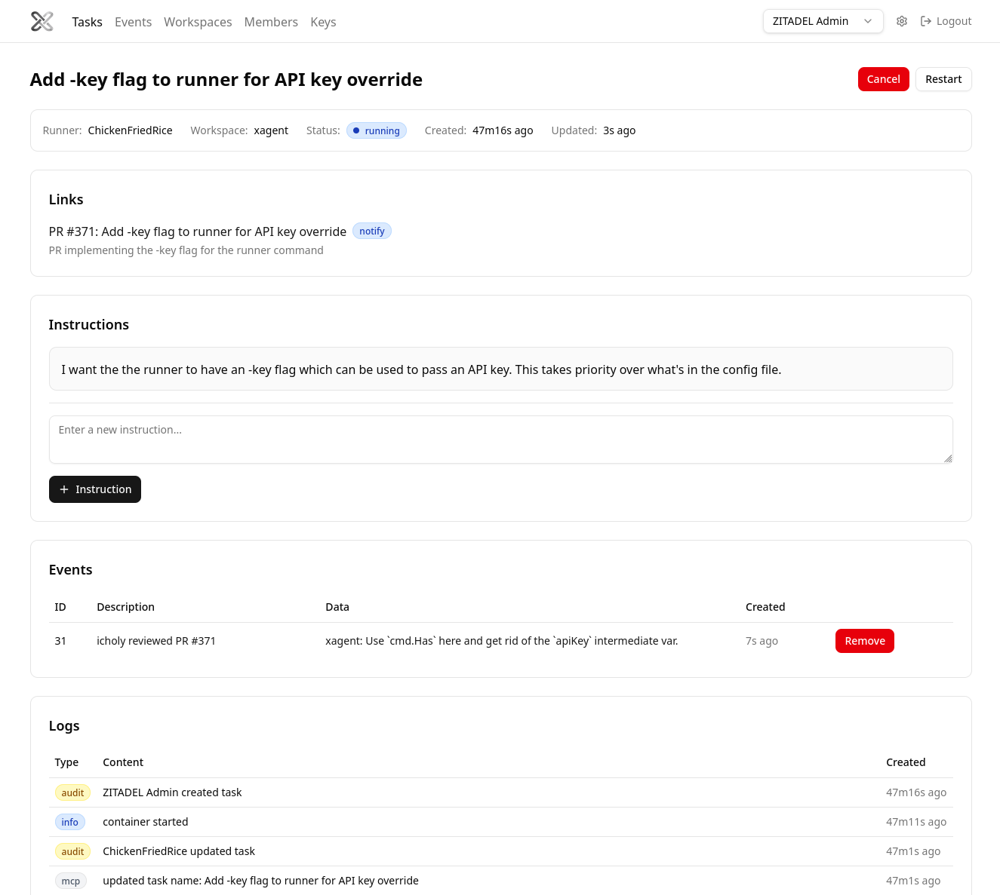

# XAGENT

Runs coding agents (Claude Code, Codex, Cursor, GitHub Copilot) inside remote self-hosted Docker containers.

## Web UI



## Quick Start

Install `xagent` cli:

```bash
mise run install
```

Download the pre-built binaries (if needed):

```bash
GITHUB_TOKEN=$(gh auth token) xagent download
```

Authenticate your local client:

```bash
xagent setup
```

Update the `workspaces.yml` file (see examples below):

```bash
vim ~/.config/xagent/workspaces.yaml
```

Start the local runner:

```bash
xagent runner
```

Create and monitor tasks via the Web UI.

Open: https://xagent.choly.ca/

## Workspace Examples

See [examples/workspaces/](examples/workspaces/) for workspace configuration examples:

- [claude.yml](examples/workspaces/claude.yml) - Claude Code
- [codex.yml](examples/workspaces/codex.yml) - OpenAI Codex
- [cursor.yml](examples/workspaces/cursor.yml) - Cursor Agent
- [copilot.yml](examples/workspaces/copilot.yml) - GitHub Copilot
- [mcp-server.yml](examples/workspaces/mcp-server.yml) - MCP server configuration
- [private-repo.yml](examples/workspaces/private-repo.yml) - Cloning private repositories
- [dummy.yml](examples/workspaces/dummy.yml) - Dummy agent for testing

## Docker Compose Runner

See [examples/runner/](examples/runner/) for running the runner as a Docker Compose service with a pull-through registry cache.

## Debugging

View container logs:

```bash
xagent logs -f <taskid>
```

Get a shell to a task container:

```bash
xagent shell <taskid>
```

List task containers

```bash
xagent containers
```

## Local Development

```bash
# Start server and postgres locally
docker compose up -d

# Run the FE
cd webui
pnpm install
pnpm run dev
```

The local server runs with `--no-auth`, but the runner still requires an API key.
Create one in the local Web UI at http://localhost:5173/ui/keys/new, then start the runner:

```bash
xagent runner --server http://localhost:6464 -key <api-key>
```


### Build

```bash
mise run build      # Build main + prebuilt binaries (linux amd64/arm64)
mise run generate   # Generate protobuf code
go build            # Build main binary only
```

## Architecture


## Schema


