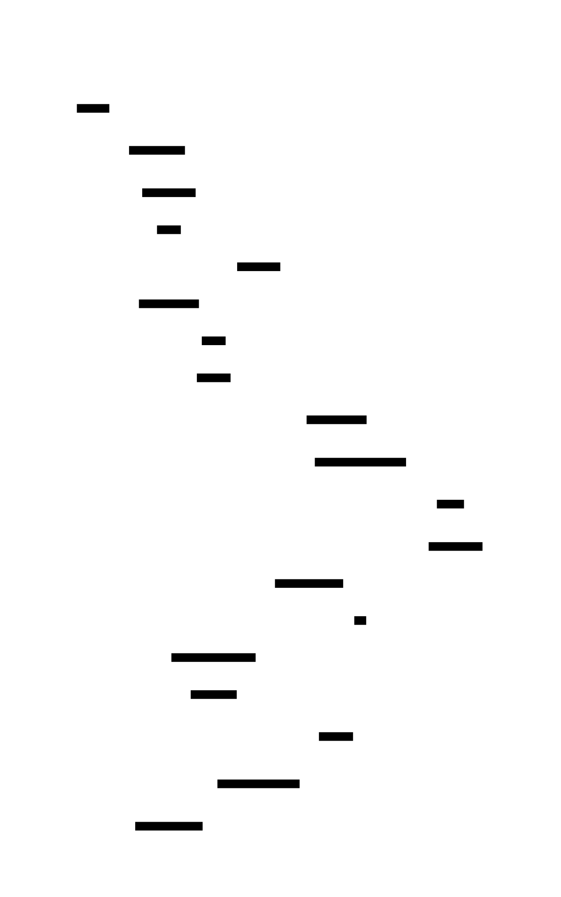

# XAGENT

An async agent orchestrator that runs multiple Claude Code instances in parallel inside containers. Agents are non-interactive and task-driven, executing prompts like "Implement JIRA ticket X and open a draft PR".

See [CLAUDE.md](CLAUDE.md) for architecture overview and development guidance.

## Architecture


XAGENT uses a botnet-style C2 (command & control) architecture where a central server coordinates task execution across containerized agents that communicate via Unix socket proxy.

## Requirements

### Functional
- [x] MCP server support for tool integration
- [x] Log collection and review from agent runs
- [x] Programmatic session creation
- [x] Session continuation with additional prompts
- [x] Docker container execution

### Communication Model

Connect RPC over HTTP:
- Agent polls C2 for commands
- Uploads logs in batches
- Simple, stateless, works well with containers

## Container Networking

Containers communicate with the C2 server via a Unix socket proxy:


- Runner creates a Unix socket proxy at `/tmp/xagent.sock`
- Socket is bind-mounted into containers at `/var/run/xagent.sock`
- Agents connect using `unix:///var/run/xagent.sock`
- Proxy forwards requests to the C2 server

## Components

### C2 Server
- Connect RPC API for task management
- SQLite for task metadata and logs
- Web UI for task monitoring

### Runner
- Polls C2 server for pending tasks
- Creates Unix socket proxy for container-to-server communication
- Manages Docker container lifecycle (start, restart, monitor exits)
- **Reconciliation**: On startup, syncs task status with container state (handles runner restarts)
- **Monitoring**: Watches for container `die` events and updates task status based on exit code
- **Cancellation**: Kills containers for cancelled tasks

### Agent
- Runs Claude Code via CLI (`npx @anthropic-ai/claude-code --print`)
- Executes tasks with `--continue` flag for resumption
- Stores local state in `~/.xagent/{task-id}.json`
- Accesses injected `xagent` MCP server for task communication tools

### Conceptual Model

- **Task** (server-side): Unit of work with workspace reference and prompts
- **Agent** (runtime): Container process executing a task (1:1 relationship)
- **Session** (Claude Code): Conversation state, lost if container is destroyed

## Data Flow



## Quick Start

```bash
# Start server
xagent server --addr :8080

# Start runner (separate terminal)
xagent runner --server http://localhost:8080

# Create a task
xagent task create --workspace myworkspace --prompt "Implement feature X"

# Monitor via Web UI
open http://localhost:8080
```

For detailed CLI reference, see [CLAUDE.md](CLAUDE.md).

## Webhook Integration

XAGENT supports webhook-based event integration with GitHub and Jira using AWS Lambda and SQS. This replaces the legacy polling approach with a more reliable, event-driven architecture.

### Architecture

```
GitHub/Jira Webhook → Lambda Function URL → SQS → xagent subscribe → xagent server
```

### Quick Setup

1. Deploy infrastructure using Terraform (see `terraform/` directory)
2. Configure webhooks in GitHub/Jira with the Lambda Function URLs
3. Start the subscriber:

```bash
export SQS_QUEUE_URL="<from terraform output>"
xagent subscribe --workspace myworkspace
```

For detailed setup instructions, see [docs/WEBHOOK_SETUP.md](docs/WEBHOOK_SETUP.md).

### Usage

**Create new tasks from comments:**
```
xagent new Implement feature X and open a PR
```

**Notify existing tasks:**
```
xagent task Update the implementation based on review feedback
```

The webhook system automatically creates events and routes them to linked tasks.

## Workspaces

Workspaces define container environment and MCP servers in `workspaces.yaml`. The runner auto-injects an `xagent` MCP server for task communication tools.

Example:
```yaml
myworkspace:
  commands:
    - git clone https://github.com/org/repo /workspace
  container:
    image: node:20
    working_dir: /workspace
    volumes:
      - /host/path:/container/path
  agent:
    cwd: /workspace
    mcp_servers:
      filesystem:
        command: npx
        args: ["-y", "@anthropic-ai/mcp-filesystem", "/workspace"]
```

## Authentication

The Claude CLI supports two authentication methods:

| Env Var | Source | Billing |
|---------|--------|---------|
| `ANTHROPIC_API_KEY` | [console.anthropic.com](https://console.anthropic.com) | Pay-per-use |
| `CLAUDE_CODE_OAUTH_TOKEN` | `claude setup-token` | Subscription (Pro/Max) |

**Important:** Do not set both environment variables. The SDK prioritizes `ANTHROPIC_API_KEY` over `CLAUDE_CODE_OAUTH_TOKEN`. If both are set and `ANTHROPIC_API_KEY` is invalid, you'll get auth errors even with a valid OAuth token.

To use a Claude subscription:
```bash
# Generate token (interactive, opens browser)
claude setup-token

# Use in container
export CLAUDE_CODE_OAUTH_TOKEN=sk-ant-oat01-...
```

## Storage

SQLite database at project root:

```
xagent.db              # SQLite database
```

### Tasks Table

```sql
CREATE TABLE tasks (
    id            INTEGER PRIMARY KEY AUTOINCREMENT,
    name          TEXT NOT NULL DEFAULT '',
    parent        INTEGER NOT NULL DEFAULT 0,
    workspace     TEXT NOT NULL,
    prompts       TEXT NOT NULL,  -- JSON array of prompts
    status        TEXT NOT NULL,  -- pending, running, completed, failed, cancelled, archived
    created_at    DATETIME DEFAULT CURRENT_TIMESTAMP,
    updated_at    DATETIME DEFAULT CURRENT_TIMESTAMP
);
```

### Task Links Table

```sql
CREATE TABLE task_links (
    id         INTEGER PRIMARY KEY AUTOINCREMENT,
    task_id    INTEGER NOT NULL,
    relevance  TEXT NOT NULL,
    url        TEXT NOT NULL,
    title      TEXT,
    notify     BOOLEAN DEFAULT FALSE,
    created_at DATETIME DEFAULT CURRENT_TIMESTAMP,
    FOREIGN KEY (task_id) REFERENCES tasks(id)
);
```

### Logs Table

```sql
CREATE TABLE logs (
    id         INTEGER PRIMARY KEY AUTOINCREMENT,
    task_id    INTEGER NOT NULL,
    type       TEXT NOT NULL,     -- "info", "error", "llm"
    content    TEXT NOT NULL,
    created_at DATETIME DEFAULT CURRENT_TIMESTAMP,
    FOREIGN KEY (task_id) REFERENCES tasks(id)
);
```

### Events Table

```sql
CREATE TABLE events (
    id          INTEGER PRIMARY KEY AUTOINCREMENT,
    description TEXT NOT NULL,
    data        TEXT NOT NULL,
    url         TEXT,
    created_at  DATETIME DEFAULT CURRENT_TIMESTAMP
);
```

### Event Tasks Table

```sql
CREATE TABLE event_tasks (
    event_id INTEGER NOT NULL,
    task_id  INTEGER NOT NULL,
    PRIMARY KEY (event_id, task_id),
    FOREIGN KEY (event_id) REFERENCES events(id),
    FOREIGN KEY (task_id) REFERENCES tasks(id)
);
```

## API Design

Connect RPC API defined in `proto/xagent/v1/xagent.proto`. Generated Go code → `internal/proto/` (gitignored).

Core RPCs: `ListTasks`, `CreateTask`, `GetTask`, `UpdateTask`, `DeleteTask`, `UploadLogs`, `CreateLink`, `FindLinksByURL`

### Agent State

Stored in `~/.xagent/{task-id}.json` with session status (`started`) and prompt tracking (`prompt_index`).

### Task Lifecycle

1. Client creates task: `CreateTask` with workspace, prompts (status: `pending`)
2. Runner detects pending task via `ListTasks(status: "pending")`
3. Runner starts container `xagent-{task-id}` with `xagent run --task {id}`
4. Runner marks task as `running` via `UpdateTask`
5. Agent runs setup commands from workspace config
6. Agent calls `GetTask` to get task details (including prompts)
7. Agent creates Claude session, stores state locally in `~/.xagent/{task-id}.json`
8. Agent executes `prompts[prompt_index]` via `npx @anthropic-ai/claude-code --print`
9. Agent increments local `prompt_index`, sets `started: true`
10. Agent polls `GetTask` for new prompts
11. When done, agent exits (exit code 0 = completed, non-zero = failed)
12. Runner Monitor detects container exit and updates task status

**Follow-up prompts:**
1. Client adds prompt: `UpdateTask` with `add_prompts` → server sets status to `pending`
2. Runner detects pending status, restarts container `xagent-{task-id}`
3. Agent resumes with `--continue`, executes new prompt

**Runner Restart:**
1. Runner calls `Reconcile()` on startup
2. Finds exited containers with tasks still marked "running"
3. Inspects container exit code and updates task status

## Build

```bash
mise run build      # Build main + prebuilt binaries (linux amd64/arm64)
mise run generate   # Generate protobuf code
go build            # Build main binary only
```

## Open Questions

1. **Scaling**: How many concurrent agents?
   - Resource limits per container
   - API rate limiting considerations

2. **Security**:
   - Agent authentication to C2
   - Secrets management (API keys)
   - Network isolation

3. **Git/GitHub access**:
   - How do agents authenticate to push branches/PRs?
   - SSH keys? GitHub App? PAT?
