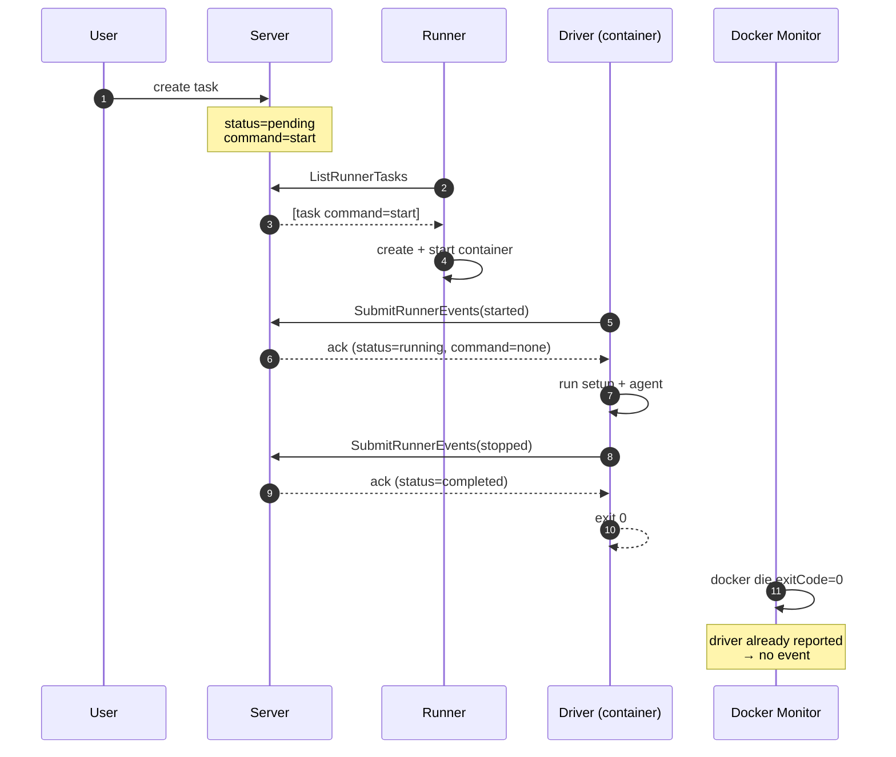
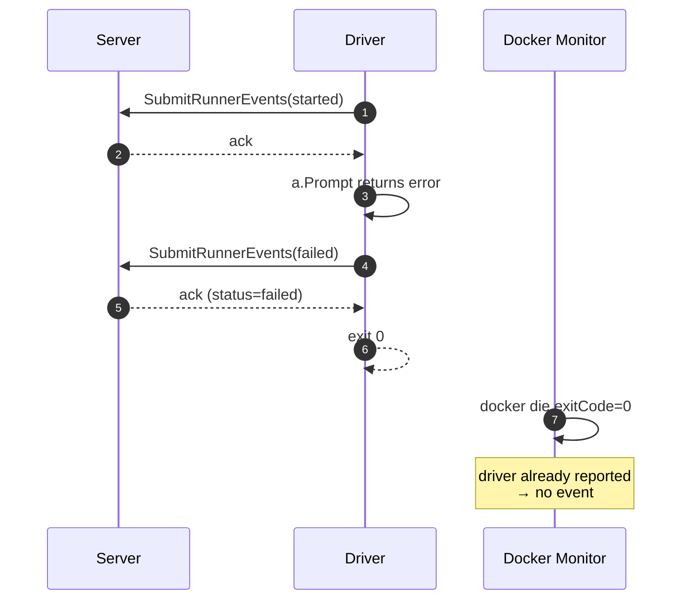
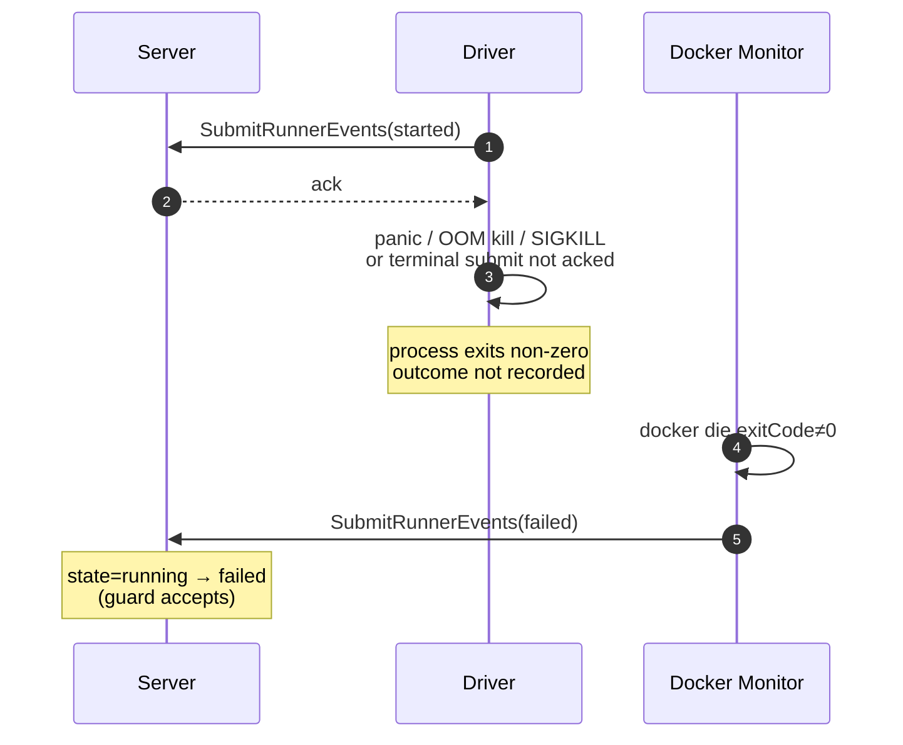
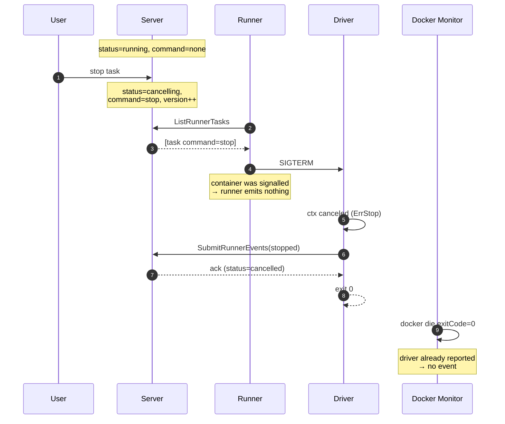
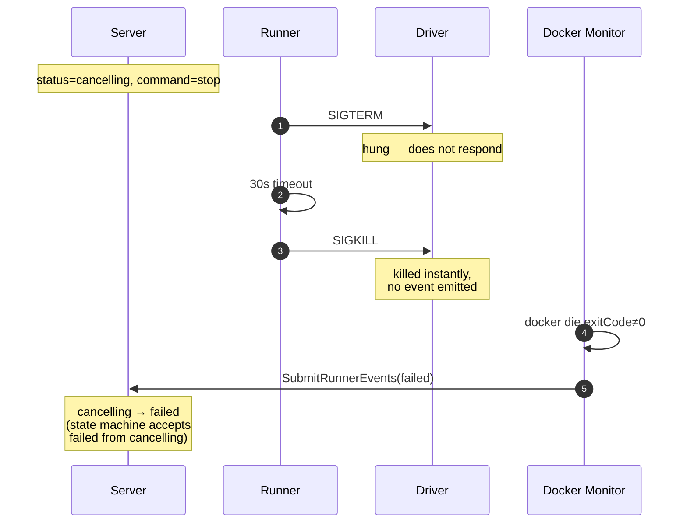
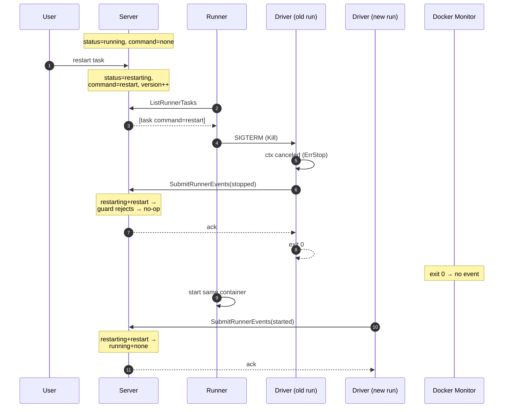
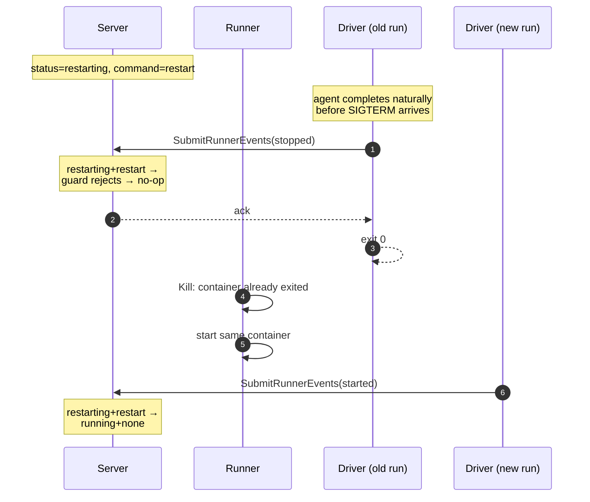
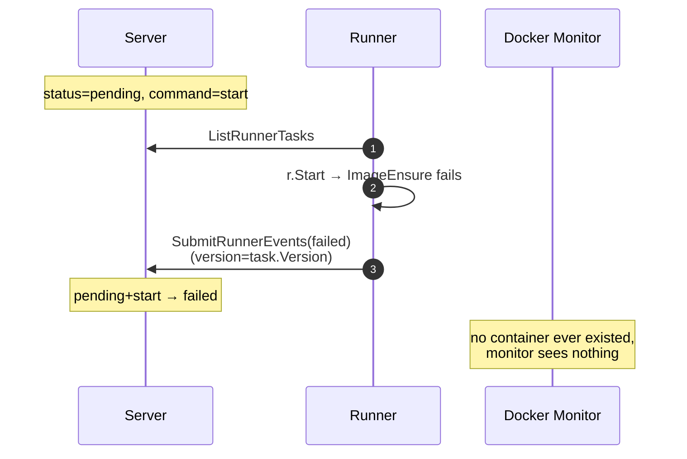
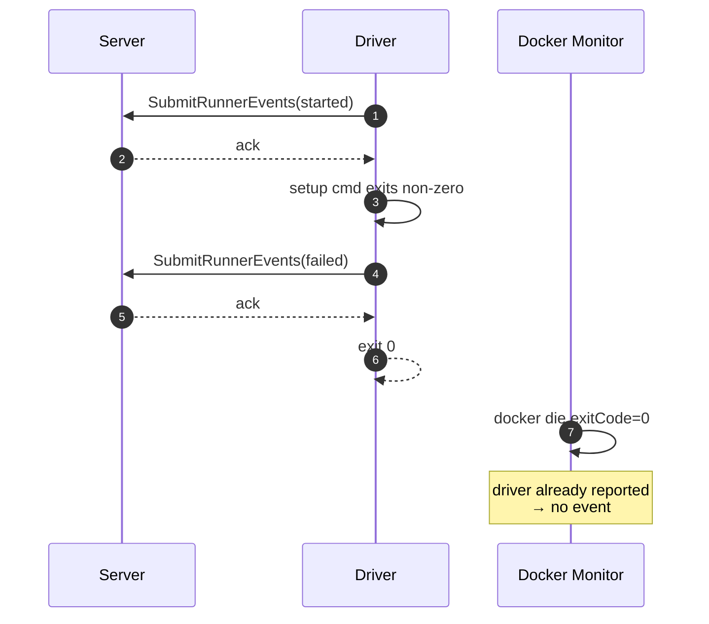

# Driver-Owned Runner Events

## Problem

Today the runner emits all `RunnerEvent`s (`started`, `stopped`, `failed`) on behalf of the container by observing Docker events (`internal/runner/runner.go`):

- `runner.Monitor` subscribes to docker `start` and `die` events and maps exit codes to `RunnerEventStopped` / `RunnerEventFailed`.
- `runner.Poll` emits `failed` / `stopped` when a command (start / restart / stop) fails to dispatch.
- `runner.Reconcile` scans exited containers at runner startup and emits the corresponding event.

The driver process (`internal/agent/driver.go`) is the entity actually running the agent and knows *exactly* what happened — success, agent error, setup error, graceful stop — but currently only communicates through its exit code, which the runner re-interprets via Docker.

This proposal moves the source of truth for `started` / `stopped` / `failed` into the driver. The runner speaks only when the driver can't: when no container exists, or when the driver died without reporting.

## Design

### Invariant

The driver returns non-zero **only when it could not report its outcome itself**. If it successfully submits a `stopped` or `failed` event and gets an ack, it exits 0. If any terminal submit fails — including `stopped` — it exits non-zero.

The exit code is therefore a single bit meaning "did the driver report?", and the runner's monitor reads it as exactly that: exit 0 → the outcome is already recorded, emit nothing; exit non-zero → the outcome was lost, emit `failed`.

### Authorization

No new authorization surface is needed. The driver already talks directly to the C2 with a task-scoped JWT (see proposals/implemented/eliminate-runner-socket-proxy.md), and `SubmitRunnerEvents` authorizes each event against the loaded task row — the task token's `task.write` scope only matches the driver's own task.

Driver-emitted events use `Version: 0` (same convention as today's monitor — spontaneous events bypass the version check).

### Driver event ownership

| Event | When the driver emits it |
|---|---|
| `started` | Immediately on entry (replaces `client.Ping`). If the submit succeeds, the connection, token, server, and DB are all healthy — no separate ping needed. |
| `failed` | Setup command failure; agent error from `a.Prompt`. |
| `stopped` | Clean agent completion; the `agent.ErrStop` cancellation path (SIGTERM — for both stop and restart). |

The driver **waits for ack** on every submit (the `SubmitRunnerEvents` handler in `internal/server/apiserver/runner.go` commits the DB transaction before returning, so a nil error means the state transition is durable). The ack decides the exit code per the invariant.

Events are submitted on a context that survives the SIGTERM cancellation — the terminal events go out *after* the run context is torn down — bounded by the client's HTTP timeout.

### Restart: the state machine already routes `stopped`

Restart keeps today's mechanics: the runner kills the container (SIGTERM) and starts the **same container** again. The driver doesn't need to know whether a SIGTERM means stop or restart, because the status-guarded state machine in `internal/model/task.go` disambiguates:

- Under `cancelling+stop`, the driver's `stopped` lands the task in `cancelled`.
- Under `restarting+restart` (or `pending+restart` from a terminal state), `stopped` falls through the status guard and is **ignored** — the command survives, the runner's restart branch starts the container again, and the new run's `started` clears the command (`→ running+none`).

So the driver treats every SIGTERM identically: cancel the agent with `ErrStop`, emit `stopped`, wait for the ack, exit 0.

The ack-wait also serializes event ordering for free: the old run's `stopped` is durably applied before its process exits, and `runner.Kill` waits for the container to exit before `runner.Start` runs — so `stopped` always lands before the next run's `started`.

Because the same container is restarted (a recreate only happens if the container was removed), the filesystem persists: setup state (`SetupCommandsCompleted`) carries over and setup commands are not re-run.

#### Why not an in-place reload?

An earlier revision of this proposal kept the driver alive across restarts with a SIGHUP-triggered in-place reload (cancel the agent run, re-emit `started`, re-prompt — the container never stops). It was dropped: two racing signals forced layered cancellation contexts, a reload-then-stop override, concurrent-SIGHUP gating, a SIGHUP-at-natural-completion self-heal path, and a driver-side unwind timeout — all to save one container stop/start (~1–2s, same container, no setup re-run) on the restart happy path. The failure outcomes were identical in both designs (a hung agent lands in `failed` either way), so the simpler model wins.

### The runner speaks only when the driver can't

Every remaining runner emit covers a case where no driver exists or the driver died without reporting:

- **`runner.Monitor`** subscribes only to docker `die` events (the `start` subscription and its `started` emit are removed — the driver's `started` replaces them). Exit non-zero → emit `failed`: the driver died without reporting. Exit 0 → emit **nothing**: by the invariant, the outcome is already recorded. The `die` handler keeps its semaphore-release / wake-up bookkeeping either way.
- **`runner.Poll`**'s stop branch emits `stopped` only when there was **no running container to signal** — a stop command for an already-dead container has no driver to complete it, and without the emit the task would be stuck in `cancelling`. When a container was signalled, the driver owns the report (and if it hangs, SIGKILL → non-zero exit → the monitor's `failed`). `Kill` reports whether it signalled a running container.
- **`runner.Poll`**'s dispatch-failure emits (`failed` when the image pull or `r.Start` fails) are unchanged — no container exists, so the driver can't report these.
- **`runner.Reconcile`** emits `failed` for any exited container whose task is still `running`, regardless of exit code. By the invariant, an exit-0 container whose task is still `running` means the driver's report was lost — `failed` is the honest outcome. (Today's exit-code mapping to `stopped`/`failed` goes away.)

A side effect of removing the stop branch's unconditional `stopped`: a cancel whose driver hangs until SIGKILL now lands **deterministically** in `failed`. Today that outcome races the runner's `stopped` (→ `cancelled`) against the monitor's `failed`, and either can win.

### Why duplicates are safe

Duplicate events become rare (the monitor no longer mirrors every exit), but races can still produce them — e.g. a container that exits between the stop branch's "is it running?" check and the kill, where both the dying driver and the runner emit `stopped`. The state machine in `internal/model/task.go` is status-guarded, so duplicates remain harmless:

- `applyRunnerEventStarted` only transitions from `pending` / `restarting` / `running` *with* a `start` or `restart` command. A second `started` after the first hits a state with `command=none` and returns `false`.
- `applyRunnerEventStopped` only transitions from `running` / `cancelling`. A subsequent `stopped` after the task moved to `completed` / `cancelled` / `failed` falls through to `default` and returns `false`.
- `applyRunnerEventFailed` only transitions from non-terminal states. Same idempotency.

### The "exit before ack" race

In the old model, a driver that died before its `failed` event was delivered could exit 0, and the monitor's exit-0 `stopped` fallback would silently mark the task `completed`. That race is now structurally impossible: there is no exit-0 fallback. An unacked terminal submit exits non-zero, and the only thing the monitor ever emits on `die` is `failed`.

The trade-off: a successful run whose `stopped` ack fails (C2 briefly unreachable at the moment of completion) lands in `failed` rather than `completed` — an explicit "the report was lost" rather than a silent wrong answer. If false `failed`s show up in practice, the driver can retry the submit briefly before giving up.

---

## Sequence diagrams

### 1. Normal completion (agent finishes successfully)

### 2. Agent error (driver reports failure)

### 3. Driver crash (process dies before reporting)

### 4. Cancel (user issues stop)

> If the container is **not** running when the stop command is processed, there is no driver to complete the cancel: the stop branch emits `stopped` itself (version=task.Version) so the task reaches `cancelled` instead of sticking in `cancelling`.

### 5. Cancel timeout (SIGKILL fallback)

> This lands in `failed` rather than `cancelled` — and now deterministically so. Today the runner's unconditional `stopped` races the monitor's `failed` and either can win; with the stop branch silent after signalling a live container, `failed` is the only possible outcome. A hung cancel is a failure worth surfacing.

### 6. Restart (kill + start the same container)

> The driver's `stopped` under a pending restart is rejected by the status guard, so the restart command survives until the new run's `started` consumes it. Restart from a terminal state (`completed` / `failed` / `cancelled` → `pending+restart`) is the same flow minus the kill: the container has already exited, so `Poll` just starts it.

### 7. Restart races natural completion

> No special handling: a `stopped` from a natural completion and a `stopped` from the restart's SIGTERM are routed identically by the status guard.

### 8. Image pull / dispatch failure (runner still emits)

### 9. Setup-command failure (driver emits before exiting)

---

## Migration notes

- `internal/agent/driver.go`:
  - Drop `client.Ping`; emit `started` on entry and wait for the ack.
  - Emit `failed` on setup error / agent error, `stopped` on clean completion and on the `agent.ErrStop` path.
  - Every terminal submit's ack decides the exit code: acked → exit 0; not acked → exit non-zero so the monitor's `failed` fires. This includes `stopped` — there is no exit-0 fallback anymore.
  - Submit events on a context that survives the SIGTERM cancellation.
- `internal/runner/runner.go`:
  - `Monitor`: subscribe only to `die`; emit `failed` on non-zero exit, nothing on exit 0. Drop the `start` subscription and the `started` / exit-0 `stopped` emits. Keep the semaphore-release / wake-up bookkeeping on `die`.
  - `Poll` stop branch: `Kill` reports whether it signalled a running container; emit `stopped` only when it didn't.
  - `Poll` dispatch-failure `failed` emits: unchanged.
  - `Reconcile`: emit `failed` for any exited container whose task is still `running`, regardless of exit code.
- No protocol/schema changes. No state-machine changes. No new signals.
- Driver-emitted events use `Version: 0`.
