# Driver-Owned Runner Events

## Problem

Today the runner emits all `RunnerEvent`s (`started`, `stopped`, `failed`) on behalf of the container by observing Docker events (`internal/runner/runner.go`):

- `runner.Monitor` subscribes to docker `start` and `die` events and maps exit codes to `RunnerEventStopped` / `RunnerEventFailed`.
- `runner.Poll` emits `failed` / `stopped` when a command (start / restart / stop) fails to dispatch.
- `runner.Reconcile` scans exited containers at runner startup and emits the corresponding event.

The driver process (`internal/command/driver.go`) is the entity actually running the agent and knows *exactly* what happened — success, agent error, setup error, graceful stop — but currently only communicates through its exit code, which the runner re-interprets via Docker.

This proposal moves the source of truth for `started` / `stopped` / `failed` into the driver, with the runner's Docker monitor retained as a backup for cases where the driver process can't report (OOM, SIGKILL, image-pull failure, etc.).

## Design

### Invariant

The driver returns non-zero **only when it could not report its outcome itself**. If it successfully submits a `stopped` or `failed` event and gets an ack, it exits 0.

### AgentFilter exposes `SubmitRunnerEvents`

`internal/agentmcp/filter.go` currently routes task-scoped operations from the driver's JWT to the real server. Add:

```go
func (p *AgentFilter) SubmitRunnerEvents(ctx context.Context, req *xagentv1.SubmitRunnerEventsRequest) (*xagentv1.SubmitRunnerEventsResponse, error) {
    claims, err := p.claims(ctx)
    if err != nil {
        return nil, err
    }
    for _, ev := range req.Events {
        if ev.TaskId != claims.TaskID {
            return nil, errPermissionDenied("can only submit events for own task")
        }
    }
    return p.client.SubmitRunnerEvents(ctx, req)
}
```

Driver-emitted events use `Version: 0` (same convention as the runner's monitor — spontaneous events bypass the version check).

### Driver event ownership

| Event | When the driver emits it |
|---|---|
| `started` | Immediately on entry (replaces `client.Ping`), and again after every SIGHUP reload. If the first submit succeeds, the socket, JWT, server, and DB are all healthy — no separate ping needed. |
| `failed` | Setup command failure (`driver.go:78-92`); agent error from `a.Prompt`. |
| `stopped` | Clean agent completion; `agent.ErrStop` cancellation path. |

The driver **waits for ack** on every submit (the `SubmitRunnerEvents` handler in `internal/server/apiserver/runner.go` commits the DB transaction before returning, so a nil error means the state transition is durable).

### Restart: in-place reload via SIGHUP

The driver becomes a long-lived process with two signal semantics:

- **SIGTERM → stop**: cancel agent with `agent.ErrStop`, emit `stopped`, exit 0.
- **SIGHUP → reload**: cancel agent with `agent.ErrReload`, re-fetch task via the existing "task was updated" bootstrap prompt, emit `started` (clears `running+restart` → `running+none`), run a new agent loop. **The driver process and the container stay alive across reloads.**

This eliminates the container recreate cost on restart, removes the `Poll` re-entry window (the container never enters a created-but-not-running state during a restart), and avoids the pre-existing "stuck-in-failed after SIGKILL-during-restart" edge case (the container doesn't die during a restart at all).

Sketch:

```go
ctx, cancel := context.WithCancelCause(parentCtx)
sigCh := make(chan os.Signal, 1)
signal.Notify(sigCh, syscall.SIGTERM, syscall.SIGHUP)
go func() {
    for sig := range sigCh {
        switch sig {
        case syscall.SIGTERM:
            cancel(agent.ErrStop)
        case syscall.SIGHUP:
            // ignored if a reload is already in progress
            cancel(agent.ErrReload)
        }
    }
}()

emit(started)
for {
    err := a.Prompt(ctx, prompt, cfg.Started)
    switch context.Cause(ctx) {
    case agent.ErrStop:
        emit(stopped); return nil
    case agent.ErrReload:
        ctx, cancel = context.WithCancelCause(parentCtx)
        prompt = reloadPrompt; cfg.Started = true
        emit(started)
        continue
    }
    if err != nil { emit(failed); return err }
    emit(stopped); return nil
}
```

**PID 1 caveat:** the kernel ignores default-action signals delivered to PID 1, so the explicit `signal.Notify` registration is mandatory — SIGHUP without a handler is silently dropped.

**Reload-hang safety net:** reuse the existing 30s SIGTERM→SIGKILL timeout from `runner.Kill` driver-side. If `a.Prompt` doesn't return within the timeout after `ErrReload`, the driver exits non-zero — the monitor's `failed` fallback then catches it.

**Concurrent-SIGHUP handling:** while a reload is in progress, further SIGHUPs are ignored (gated by a `reloading` flag set by the main loop, cleared once `emit(started)` completes for the new agent).

**Reload-then-stop race:** SIGTERM arriving during an in-progress reload wins — it cancels with `ErrStop`, the partially-set-up new agent context is abandoned, driver emits `stopped` and exits.

**SIGHUP-at-natural-completion race:** if SIGHUP arrives at the same moment the agent returns success, the driver doesn't go back to handle it — it emits `stopped` and exits. The runner's next `Poll` sees `running+restart` still set and the container not running, and falls into the recreate-and-start path. Self-heals.

### Driver run-loop state machine

The driver's run loop is an NFA with three live (in-flight) states, distinguished by which cancel — if any — has been issued for the current agent run:


- **Running** — a run is in flight and no cancel has been issued. It exits to `Done`/`Failed` on natural completion, or moves to `Reloading`/`Stopping` on a signal.
- **Reloading** — `cancel(ErrReload)` has been issued (SIGHUP) and the run is unwinding. When it returns, the loop resumes with the reload prompt.
- **Stopping** — `cancel(ErrStop)` has been issued (SIGTERM) and the run is unwinding to a graceful stop.

Two races fall out of the topology:

- **Reload-then-stop:** reload has no stored bit (just a one-shot cancel), so a SIGTERM arriving during `Reloading` transitions to `Stopping` and wins.
- **The nil race** (dashed edges): if a run returns `nil` at the same instant a signal lands, the completed work is honored and the outcome is `Done` — a late cancel does not discard a genuinely finished run.

### Runner responsibilities after the change

- **`runner.Monitor`** keeps subscribing to docker `start` / `die` events. Its emits are no-ops in the happy path because the status-guarded `Task.ApplyRunnerEvent` state machine ignores redundant transitions. The monitor exists for processes that died before they could speak (OOM, SIGKILL, exec failure).
- **`runner.Poll`** for the `restart` command no longer kills + recreates the container. Instead it sends SIGHUP to the running container's PID 1. If the container isn't running, it falls back to today's recreate-and-start path. `Poll` still emits `failed` for command-time dispatch failures (image pull fails, `r.Start` fails) — no container exists, so the driver can't report these.
- **`runner.Kill`** splits into a parameterized `r.Signal(task, signal)`: stop sends SIGTERM, restart sends SIGHUP.
- **`runner.Reconcile`** is unchanged — by definition no driver is running when the runner restarts and finds an already-exited container.

### Why duplicates are safe

The state machine in `internal/model/task.go` is status-guarded:

- `applyRunnerEventStarted` only transitions from `pending` / `restarting` / `running` *with* a `start` or `restart` command. A second `started` after the first hits a state with `command=none` and returns `false`.
- `applyRunnerEventStopped` only transitions from `running` / `cancelling`. A subsequent `stopped` after the task moved to `completed` / `cancelled` / `failed` falls through to `default` and returns `false`.
- `applyRunnerEventFailed` only transitions from non-terminal states. Same idempotency.

So driver-emit + monitor-emit duplicates are harmless.

### The "exit before ack" race

If the driver tries to emit `failed` but exits before the RPC completes:

1. Driver process exits (exit code TBD).
2. Container dies. Docker emits `die`.
3. Monitor sees exit code:
   - If exit non-zero → emits `failed`. State machine accepts. Correct.
   - If exit 0 → emits `stopped`. State machine moves `running` → `completed`. **Failure silently swallowed.**

Mitigation: the driver must **wait for ack** before deciding what exit code to use. If the ack landed, exit 0 is safe. If not, exit non-zero so the monitor's `failed` fallback fires.

---

## Sequence diagrams

### 1. Normal completion (agent finishes successfully)

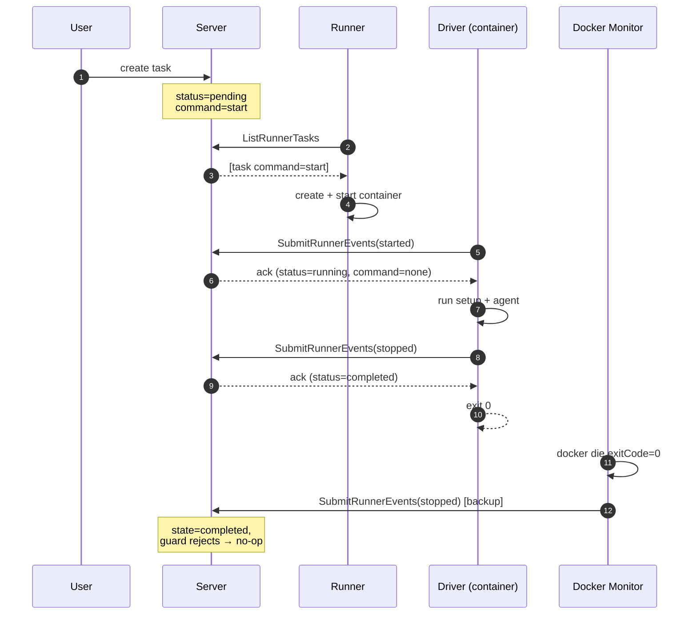

### 2. Agent error (driver reports failure)

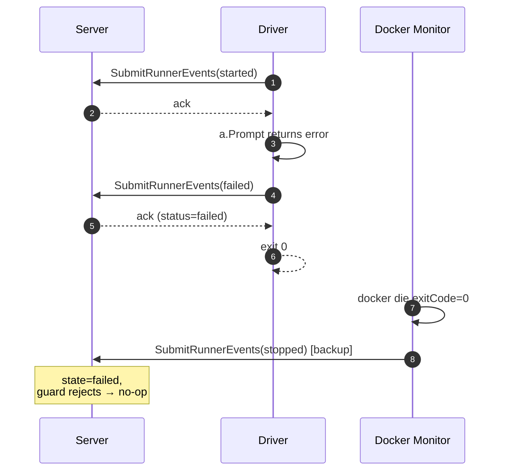

### 3. Driver crash (process dies before reporting)

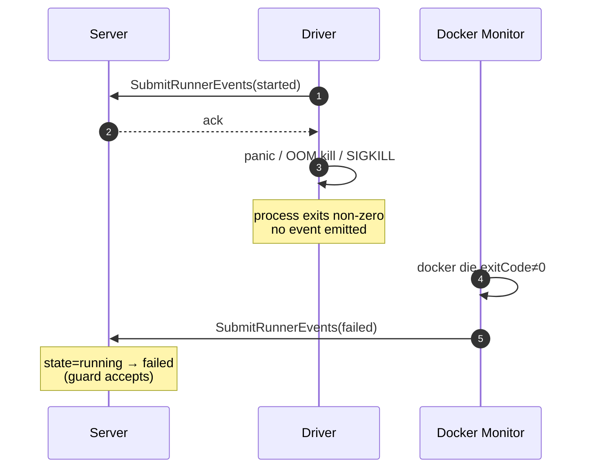

### 4. Cancel (user issues stop)

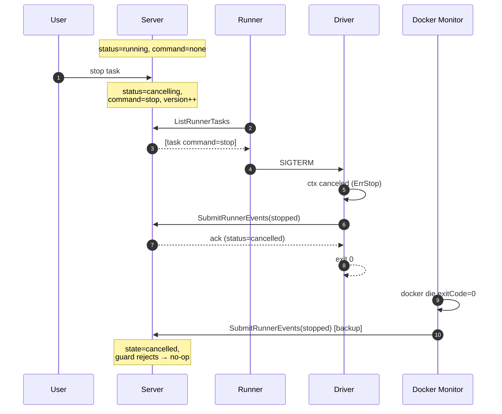

### 5. Cancel timeout (SIGKILL fallback)

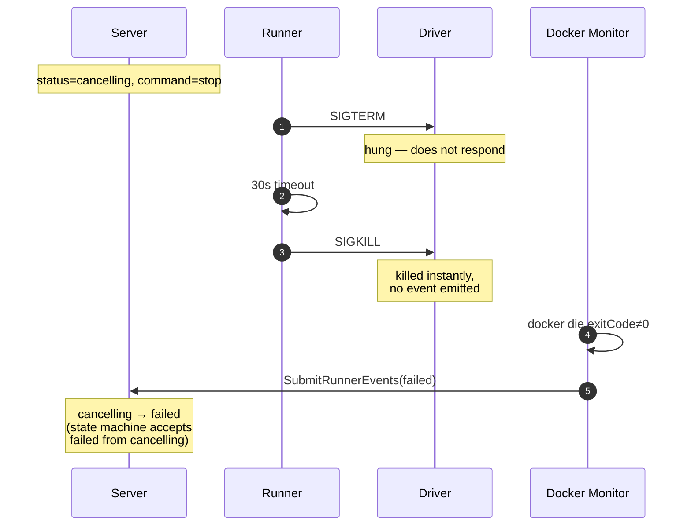

> **Open question:** today this lands in `failed` rather than `cancelled`. Acceptable, but worth confirming.

### 6. Restart (happy path, SIGHUP in-place reload)

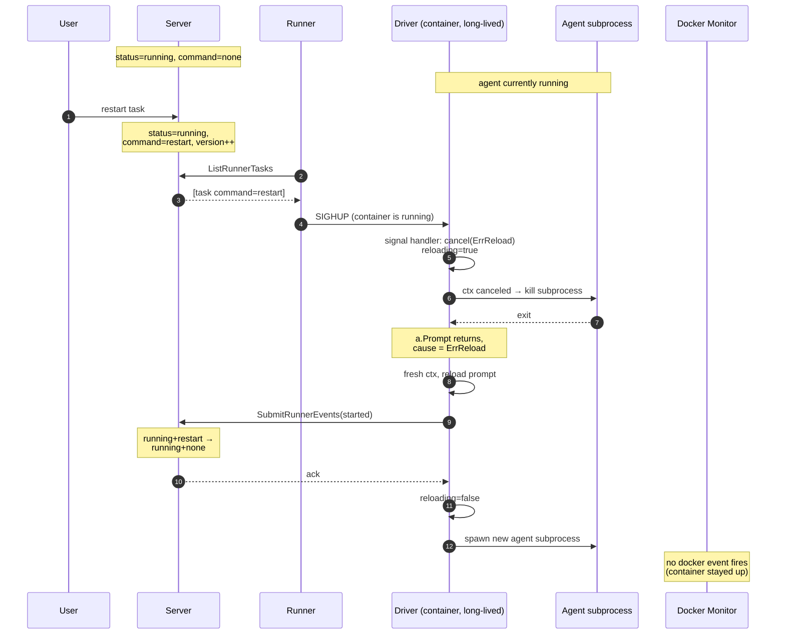

> The old agent's `stopped` is **not emitted** during a reload — the driver knows the cancellation cause is `ErrReload`, so it skips straight to emitting `started` for the new agent. No wasted RPC, no race with the state machine.

### 7. Restart fallback (container not running)

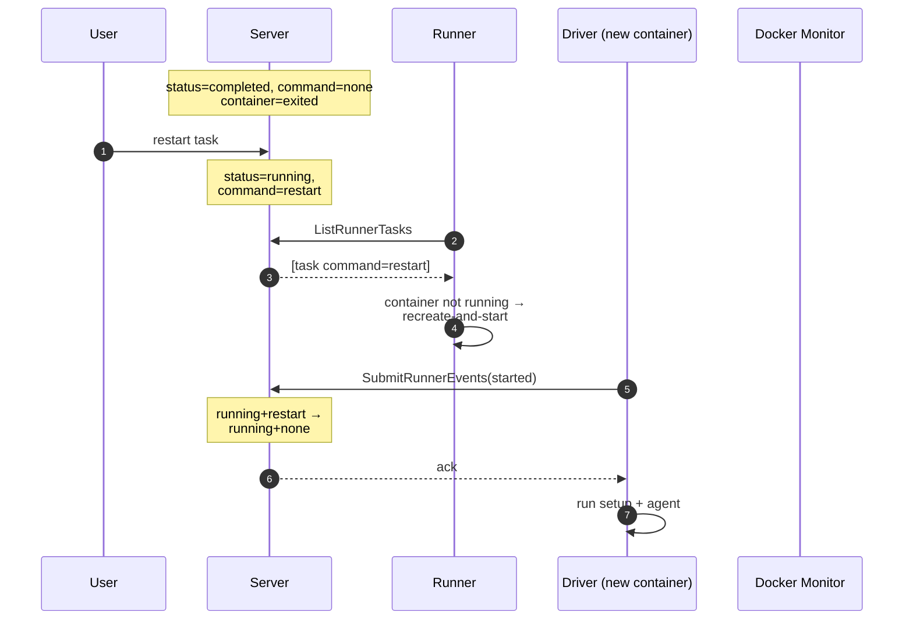

> When the container has already exited (task completed/failed/cancelled then restarted), `Poll`'s restart branch can't SIGHUP a non-running process — it falls back to today's recreate-and-start path. Setup commands re-run if `cfg.Setup` was reset by container removal.

### 8. Reload hangs (driver-side timeout)

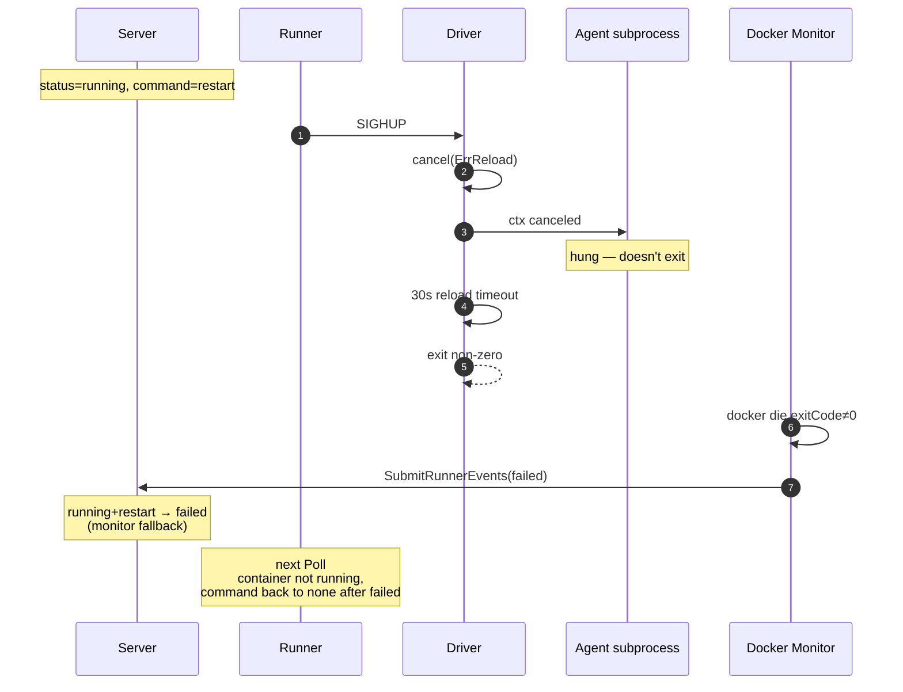

> If the agent subprocess refuses to die within the reuse of the existing SIGTERM→SIGKILL timeout, the driver exits non-zero. The monitor's `failed` fallback catches it. The task ends up in `failed` rather than running — an explicit "we tried to restart and the agent wouldn't let go" signal rather than a silent stuck state.

### 9. Reload-then-stop race (SIGTERM wins)

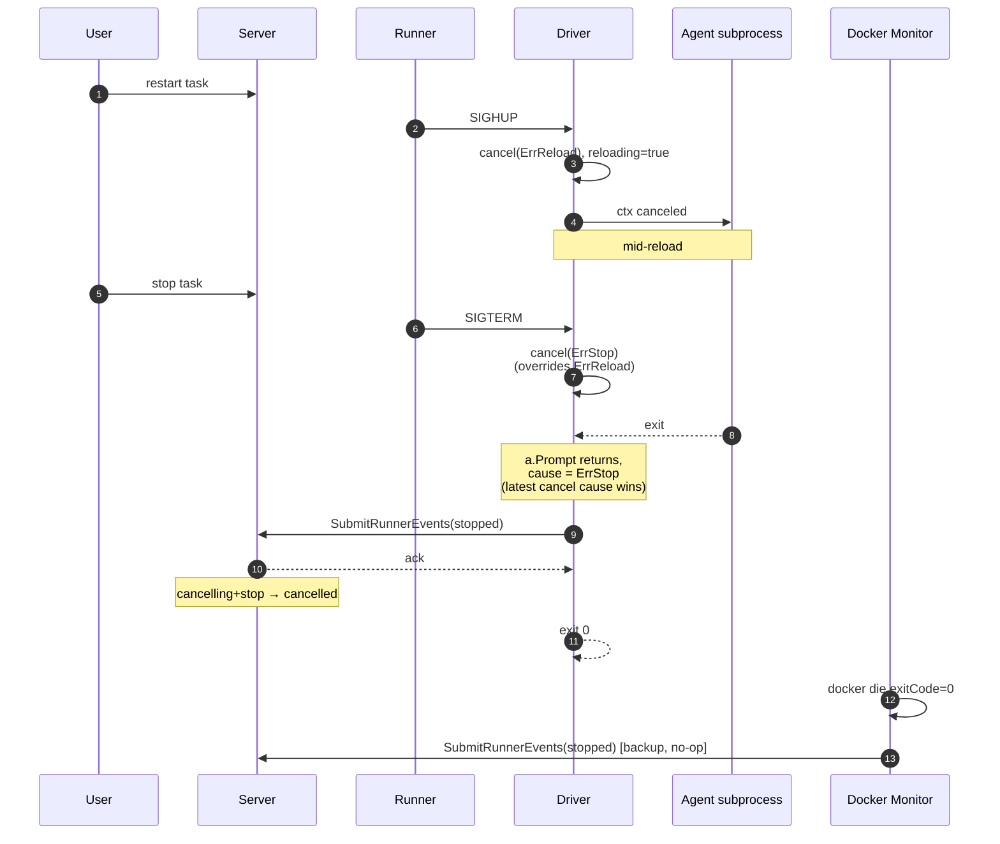

> `context.WithCancelCause` records the *first* cancel cause and ignores subsequent ones, so SIGHUP-then-SIGTERM would leave the cause as `ErrReload` — wrong. The signal handler needs an explicit override: if `ErrStop` arrives while a reload is in progress, replace the context entirely or use a layered context so SIGTERM always wins. This is the "tricky but doable" piece.

### 10. SIGHUP at natural completion (driver ignores it)

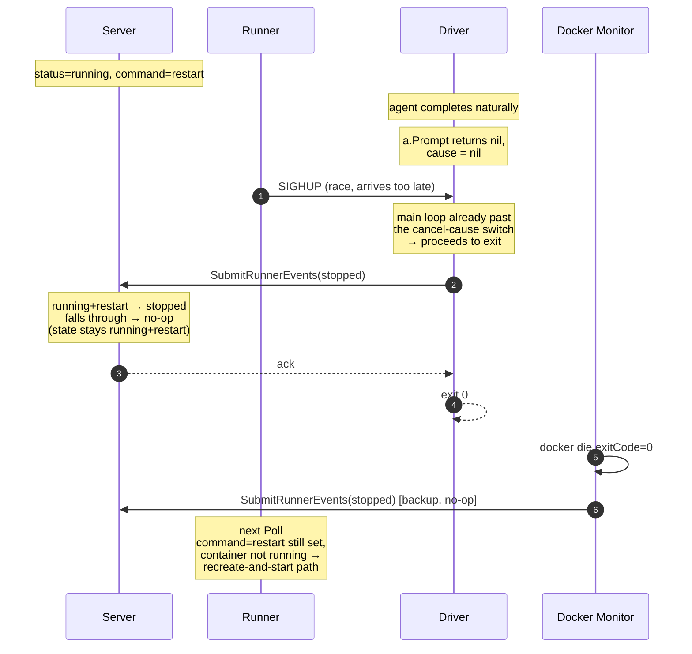

> The driver doesn't try to be clever about late SIGHUPs. The state at the server is still `running+restart` (because the driver's `stopped` is ignored under `restart`), so the runner's next `Poll` sees the unfinished restart, sees no container, and falls back to recreate-and-start. Self-healing.

### 11. Image pull / dispatch failure (runner still emits)

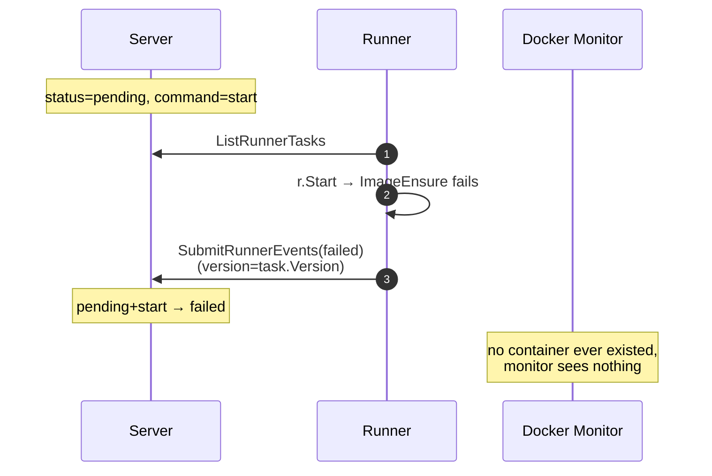

### 12. Setup-command failure (driver emits before exiting)

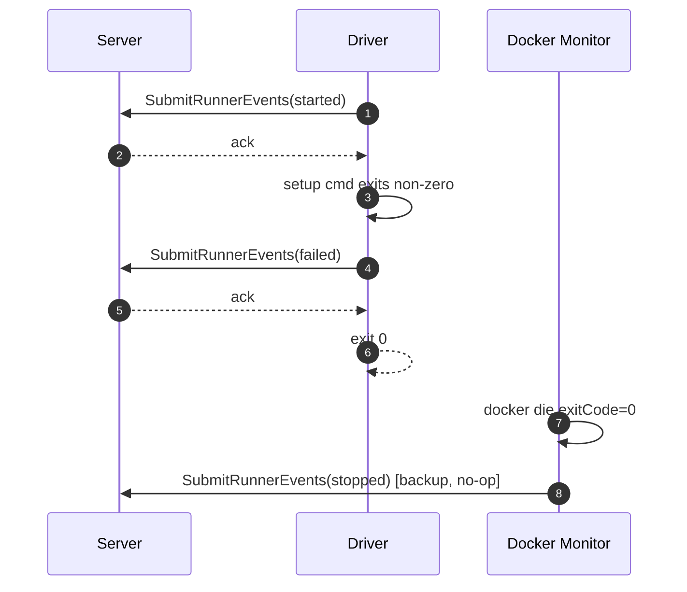

---

## Migration notes

- `internal/command/driver.go`:
  - Drop `client.Ping`.
  - Restructure into an agent-restart loop with `signal.Notify` for both SIGTERM and SIGHUP.
  - Emit `started` after constructing the client and again after every reload.
  - Emit `failed` on setup error / agent error, `stopped` on clean exit and on `agent.ErrStop`.
  - Skip emitting `stopped` when the cancel cause is `ErrReload` — emit `started` for the new agent instead.
  - Driver-side reload timeout (reuse the 30s SIGTERM→SIGKILL constant from `runner.Kill`): if the agent subprocess doesn't exit within the timeout after `ErrReload`, exit non-zero so the monitor's `failed` fallback fires.
- `internal/agent/interface.go`: add `ErrReload` sentinel alongside `ErrStop`.
- `internal/agentmcp/filter.go`: expose `SubmitRunnerEvents` constrained to `claims.TaskID`.
- `internal/runner/runner.go`:
  - Rename / parameterize `Kill` into `Signal(task, signal)`. Stop sends SIGTERM, restart sends SIGHUP.
  - Restart-command branch in `Poll`: if container is running, send SIGHUP; if not, fall back to recreate-and-start.
  - Keep `Monitor` listening to both `start` and `die` for the cases where the driver couldn't report.
  - Keep all `Poll` and `Reconcile` emits.
- No protocol/schema changes. No state-machine changes.
- Driver-emitted events use `Version: 0`.
