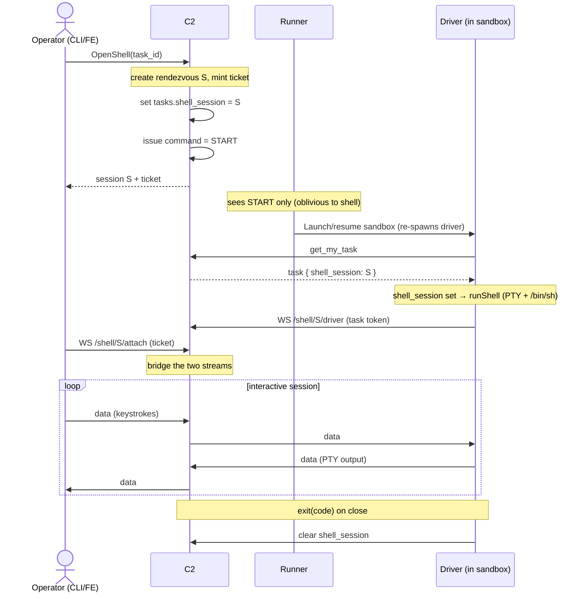

# Driver reverse shell

Issue: https://github.com/icholy/xagent/issues/1110

## Problem

`xagent shell` and `xagent logs` talk directly to the local Docker daemon: they
find the task's container by the `xagent.task=<id>` label and `docker exec -it`
(`internal/command/shell.go`). That assumes the CLI runs on the same host as the
daemon, the Docker naming/label convention, and a single backend. None of that
survives hosted/remote runners or non-Docker backends (Lambda MicroVMs today,
k8s/Fly later): the sandbox isn't reachable from the operator's machine, there's
no local socket, and each backend exposes shells differently.

We want an interactive shell into a task's sandbox **regardless of backend or
where the runner lives**, primarily for debugging ("look around and see what went
wrong"), including into a **finished** task's preserved filesystem — not just a
running one.

## Design

### Principle: the driver is the shell, the C2 is the rendezvous

The sandbox is egress-only and the operator's terminal (browser tab or laptop
CLI) isn't reachable either — so **both ends dial into the C2**, which bridges
the two streams. Rather than reach into each backend's substrate (`docker exec`,
the AWS `create-microvm-shell-auth-token` + `SHELL_INGRESS` path, `kubectl exec`,
…), the **driver** — the one component present in every sandbox, already holding
an authenticated connection to the C2 via the task token — implements the shell.
One implementation, every backend, no substrate credentials, and the existing
egress-only path already works through NAT.

### A sandbox run is one mode, chosen once

Each time a sandbox is running it is doing exactly one of two things: running the
agent, or serving a shell. They are mutually exclusive. The driver reads the task
at startup (`internal/agent/driver.go` `run()`) and forks into one path; there is
no concurrent watcher and no attach-to-a-running-agent.

### Data model: a `shell_session` field on the task (commands unchanged)

The obvious carrier — `TaskCommand` (`NONE/RESTART/STOP/START`, proto field 10) —
does **not** work: it is transient and runner-owned. The runner consumes it and
clears it to `NONE` as part of bringing the sandbox up, which happens *before*
the driver exists to read the task. By the time the driver calls `get_my_task`,
the command is already gone.

So commands stay exactly as they are (runner-only lifecycle), and we add a
separate, persistent, nullable field the runner never touches:

Proto (`proto/xagent/v1/xagent.proto`, `Task` message, next free field is 16):

```proto
message Task {
  // ... fields 1-15 unchanged ...
  string shell_session = 16;  // non-empty => this run is a shell for this rendezvous
}
```

Migration (`internal/store/sql/migrations/`, dbmate):

```sql
-- migrate:up
ALTER TABLE tasks ADD COLUMN shell_session text NOT NULL DEFAULT '';

-- migrate:down
ALTER TABLE tasks DROP COLUMN shell_session;
```

The field does double duty: it is both the **mode selector** (set = shell run)
and the **rendezvous id** (which session the driver should dial). The runner and
the whole command FSM are oblivious to it.

### Driver: fork at startup

```
task := getTask()
if task.ShellSession != "" {
    runShell(task.ShellSession)   // allocate PTY, spawn /bin/sh, dial the rendezvous
} else {
    runAgent()                    // existing path: setup commands + agent
}
```

`runShell` allocates a PTY, spawns a login shell, and connects a WebSocket to the
C2 for `shell_session`, piping the PTY master over it.

### Runner: unchanged, and deliberately oblivious

The runner keeps doing only lifecycle (`Start/Stop/Restart`) plus uniform sandbox
supervision. It does not read `shell_session`. Crucially, the sandbox lifecycle
events ("Sandbox started", "Sandbox exited (… -> …)") describe the **sandbox
run**, not the agent — so a shell run emits the identical events, and a shell run
that errors surfaces as "failed" in the timeline exactly like an agent run. No
shell-specific exit handling in the runner.

### Orchestration

Open a shell for task `N`:

1. C2 creates a rendezvous session `S` (server-side registry) and mints a
   short-lived **ticket** for the operator.
2. C2 sets `tasks.shell_session = S`, **then** issues a normal `START`/`RESTART`.
   Ordering matters: the field must be set before the sandbox boots, since the
   driver reads it once.
3. The runner brings the sandbox up (obliviously; `Launch`/resume re-spawns the
   driver against the preserved disk for a finished task).
4. The re-spawned driver reads `shell_session`, forks into `runShell`, dials the
   C2 WebSocket for `S`.
5. The operator's client dials the C2 WebSocket for `S` with its ticket; the C2
   bridges the two.



Close: the C2 (or the driver on exit) clears `shell_session` when the session
ends — never the runner — so the next `START` is a plain agent run.

### Transport: WebSocket on both legs, C2 as a byte-relay

Both legs are client-initiated WebSockets to the C2; the C2 is a **mode-agnostic
byte pump** that only tracks session lifecycle and copies frames verbatim. WS
(not Connect bidi streaming) because the web FE is a wanted-eventually consumer
and browsers cannot do client/bidi streaming over Connect — WS + xterm.js is the
only browser-native option, and using WS for both legs keeps the C2 bridge
symmetric.

New server endpoints (alongside the existing Connect handler and the raw `/events`
SSE endpoint in `internal/server/server.go`):

- Connect RPC `OpenShell(task_id) -> {session_id, ticket}` — creates `S`, sets
  `shell_session`, issues the lifecycle command, returns the operator ticket.
- `GET /shell/{session}/driver` (WebSocket) — the driver leg, authed with the
  task token.
- `GET /shell/{session}/attach` (WebSocket) — the operator leg, authed with the
  ticket.

**Framing** is an end-to-end contract between driver and client (the C2 does not
parse it): **binary** WS frames, `[1-byte type][payload]`:

- `0x00 data`   — raw PTY bytes (a PTY master is one combined stream)
- `0x01 resize` — rows/cols (SIGWINCH -> TIOCSWINSZ on the driver)
- `0x02 exit`   — shell exit code
- `0x03 ping`   — keepalive

The subprotocol negotiates a version and carries the ticket:
`Sec-WebSocket-Protocol: xagent-shell.v1, <ticket>`.

### CLI

`xagent shell <task>` is reimplemented against the C2: call `OpenShell`, connect
the `/attach` WebSocket, put the local terminal in raw mode, and pump frames. The
Docker-direct implementation in `internal/command/shell.go` is removed. Result:
one command that works for every backend and for remote runners.

### Security

This is, deliberately, a C2-commanded reverse shell baked into every sandbox — an
implant. It runs as the driver (root inside the sandbox) and can see the repo and
any injected tokens. It must be gated accordingly:

- C2-side authorization on who may `OpenShell` for a given task/org.
- Short-lived, single-use, session-scoped tickets for the operator leg (the
  browser WebSocket API cannot set an `Authorization` header, so auth must ride
  the subprotocol/ticket, not a header).
- Audit (who attached, when) and optional session recording — free, since the C2
  is in the byte path.
- WS ping/pong + a hard idle/max-session timeout, so a forgotten shell does not
  keep a billed microVM resumed indefinitely.

### Web-FE-later, without a corner

v1 can ship CLI-only, but the wire contract is frozen so the browser is just
another client of it: WS both legs, ticket auth via subprotocol (not a header),
**binary** frames (terminal output isn't UTF-8-safe), language-neutral
`[type][payload]` framing (no Go-specific codec), versioned `xagent-shell.v1`,
and a relay/driver that never know who is attached. Adding the web terminal later
is then purely an FE task (xterm.js against `/shell/{session}/attach`).

## Trade-offs

- **Driver-implemented vs. substrate-native** (`docker exec`, AWS shell token +
  `SHELL_INGRESS`, `kubectl exec`). Driver wins on backend-agnosticism, reuse of
  the existing egress-only authenticated connection, and needing no substrate
  credentials or per-backend integration. The cost: it only works while the
  driver is alive. Resume-to-respawn covers finished tasks (the filesystem is
  preserved); a **dead driver or wedged sandbox cannot be served** — that is an
  accepted non-goal, and the one place a substrate-native break-glass path would
  still be needed if we ever want it.
- **Separate `shell_session` field vs. overloading `command`.** `command` is
  cleared by the runner before the driver can read it; a separate persistent
  field is the only thing that reaches the driver, and it keeps the runner and
  the command FSM completely unchanged.
- **WebSocket vs. Connect bidi streaming.** Connect bidi is in-framework and fine
  for a Go CLI, but `connect-web`/`grpc-web` have no browser bidi, which strands
  the wanted web terminal. WS both legs is browser-ready and symmetric.
- **Shell vs. shipping logs to the C2.** An interactive shell subsumes the
  debug-logs use case (inspect state directly); the curated driver→C2 event
  stream already covers the "what did the agent do" transcript. So this replaces,
  rather than complements, the raw-log-shipping idea.

## Open Questions

- **Timeline labeling (presentation only).** Since the run outcome drives task
  status uniformly, a shell session that errors leaves the task *showing* failed
  until the next run. Should the lifecycle events carry a mode tag ("shell run
  failed" vs "agent run failed") while keeping identical `started/exited/failed`
  semantics, or be indistinguishable?
- **Who clears `shell_session`** — the C2 on session teardown, the driver on
  exit, or both (idempotent)?
- **WebSocket library** — new dependency; `github.com/coder/websocket` (minimal,
  modern) vs. `github.com/gorilla/websocket` (`gorilla/mux` is already an indirect
  dep).
- **Multi-instance C2 rendezvous.** Single-instance today → in-memory session
  registry. Horizontally scaled on Fly → the two WS legs may land on different
  instances; route both to the session owner or bridge via a shared bus
  (Postgres `LISTEN/NOTIFY`, Redis). Put the registry behind an interface now.
- **Ticket details** — TTL, single-use vs. reusable, exact scope.
- **Idle/max-session timeout defaults**, given a live shell holds a resumed
  (billed) microVM.
- **`xagent logs`** — remove/reimplement against the C2 now, or leave the
  Docker-direct path until shell lands?
