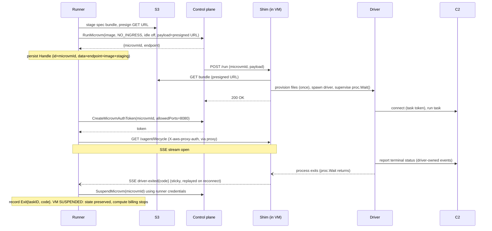
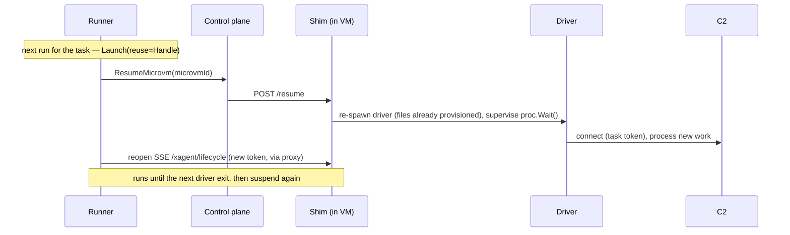
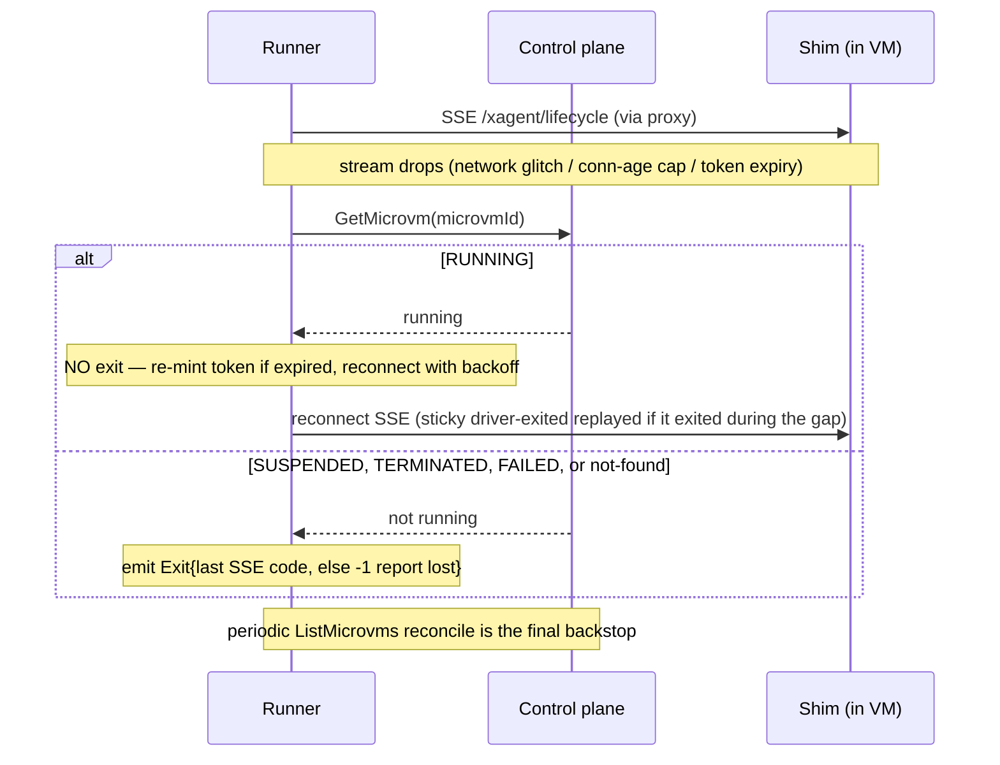
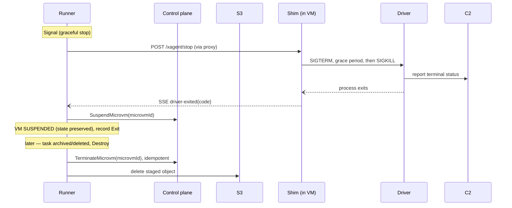

# AWS Lambda MicroVMs Backend for the Runner

Issue: https://github.com/icholy/xagent/issues/1048

> **Revision (per [#1081](https://github.com/icholy/xagent/issues/1081)).** This
> proposal originally had the in-VM shim **self-terminate** its own MicroVM when
> the driver exited, using `lambda-microvms:TerminateMicrovm` granted to the
> (untrusted) agent's execution role. The investigation in #1081 verified two
> facts that reshape the lifecycle: a MicroVM does **not** stop or stop billing
> when its process exits (so explicit termination is mandatory), and IAM **cannot**
> scope `TerminateMicrovm` to "this VM only" (so a self-terminating guest can
> terminate *sibling tasks'* VMs — a cross-task DoS). The design below moves
> termination to the **runner** (which is trusted and already holds the
> credentials) and has the in-VM shim **notify** the runner of driver completion
> over an **SSE stream through AWS's managed auth-token proxy**, with the control
> plane as the liveness authority. Implementation follows in
> [#1054](https://github.com/icholy/xagent/pull/1054).
>
> **Refinement.** Driver exit drives a **`suspend-microvm`**, not a
> `terminate-microvm`. This makes the MicroVM lifecycle symmetric with Docker — an
> exited driver suspends the VM (snapshot-storage only, no compute, full
> memory + disk preserved), the next run **`resume-microvm`**s it, and
> `terminate-microvm` happens **only** when the task is archived/deleted (or the
> `max_duration` backstop fires). This folds the proposal's deferred
> suspend/resume open question into the core lifecycle: an event-driven task
> completes, suspends cheaply, and resumes with full state on the next routed
> event — no re-clone, no re-setup. All three lifecycle verbs (suspend, resume,
> terminate) are the runner's; the guest holds no AWS credentials.

## Problem

The runner's sandbox runtime is abstracted behind `backend.Backend`
(proposals/accepted/runner-backend-interface.md), but Docker is still the only
implementation. Two isolated/managed alternatives are already proposed, and each
pays a price:

- **Firecracker** (proposals/draft/firecracker-backend.md) runs per-task KVM
  microVMs, but the runner host owns the whole virtualization stack: `/dev/kvm`,
  a guest kernel, TAP/bridge/NAT, rootfs conversion, base-image GC, the jailer.
- **Bedrock AgentCore** (proposals/draft/agent-core-backend.md) is fully managed
  with no host compute, but it is *connection-coupled* — work is driven by a held
  `InvokeAgentRuntime` request, so a runner restart risks cancelling the session
  (its central open question), and `Stop` is a hard teardown with no in-microVM
  SIGTERM.

[AWS Lambda MicroVMs](https://docs.aws.amazon.com/lambda/latest/dg/lambda-microvms-guide.html)
sit between the two. They are **AWS-managed Firecracker** — the same hypervisor
the Firecracker backend would run by hand — with no host kernel, KVM, or
networking to manage. But unlike AgentCore, microVMs are **launched
autonomously**: `run-microvm` returns a `microvmId` + `endpoint` and the VM keeps
running independently of the caller, and AWS exposes **lifecycle hooks** (`/run`,
`/suspend`, `/resume`, `/terminate`) that let us deliver a graceful in-microVM
stop. So a task's sandbox **survives a runner restart** (re-adopted by id, like a
container that outlives the runner) and a graceful stop can SIGTERM the driver —
closing the two biggest gaps in the AgentCore design — while keeping AgentCore's
"no host to run" property.

This proposal adds a `lambda-microvm` backend implementing `backend.Backend`:
AWS-managed, hardware-isolated microVMs per task with no runner-owned compute,
hypervisor, or scheduler.

## Background: the Lambda MicroVMs contract

Several facts about Lambda MicroVMs drive the design.

1. **A MicroVM image is a control-plane resource built ahead of time.** You
   package application code + a `Dockerfile` into a zip, upload to S3, and call
   `create-microvm-image`. Lambda runs the `Dockerfile`, starts your application,
   and snapshots the initialized environment. The result is a MicroVM **image
   ARN** you launch from. This is not per-task — it is built once per workspace
   and reused, analogous to AgentCore's agent runtime resource and Firecracker's
   cached base rootfs.

2. **Work starts by launching a VM, not by holding a request.** `run-microvm`
   `--image-identifier <arn>` provisions a fresh microVM from the snapshot,
   returns `{microvmId, endpoint}`, and the VM **runs autonomously** until
   suspended or terminated. There is no caller-held connection that keeps the work
   alive — the decisive difference from AgentCore. (The runner *does* hold an SSE
   notification stream to the VM, but that stream only observes the VM; dropping
   it does not stop the work, exactly as closing `docker logs` does not stop a
   container.)

3. **A MicroVM keeps running — and billing compute — until an explicit lifecycle
   call moves it.** Verified in #1081 against the AWS state table: `RUNNING →`
   anything happens **only** on an explicit `suspend-microvm` / `terminate-microvm`
   call (or `maximumDurationInSeconds`). *Nothing* transitions a VM out of
   `RUNNING` because its entrypoint/driver process exited. So an **explicit
   lifecycle action is mandatory** when the driver finishes — a "shim that just
   exits" is off the table: it would leak a billed `RUNNING` VM (with a dead
   application behind a dead endpoint) until `max_duration`. This design's action
   on driver exit is **suspend** (preserve, stop compute), not terminate (see the
   lifecycle section).

4. **Per-VM config is delivered via the run hook payload.** `run-microvm`
   `--run-hook-payload` accepts a **≤16 KB string** that Lambda delivers (with the
   injected `microvmId`) to the application's `POST /aws/lambda-microvms/runtime/v1/run`
   hook. Traffic to the endpoint begins only after `/run` returns HTTP 200.

5. **Lifecycle is run / suspend / resume / terminate, with hooks.** The
   application exposes HTTP hooks Lambda calls at each transition. The
   `/terminate` hook runs *before* resources are released — a last-chance SIGTERM
   on real teardown (distinct from the runner's own graceful-stop path, which uses
   an xagent-owned endpoint — see the shim section).
   `--maximum-duration-in-seconds` (≤28,800 = 8 h) caps total
   lifetime; `list-microvms` enumerates VMs (filterable by image). On cost:
   **running** VMs incur compute charges, **suspended** VMs incur only
   snapshot-storage charges (no compute) while preserving full memory + disk, and
   **terminated** VMs incur nothing. `resume-microvm` thaws a suspended VM back to
   `RUNNING`. This is what lets a finished task suspend cheaply and resume later
   with its filesystem and memory intact — the basis for the Docker-symmetric
   lifecycle below.

6. **A running VM is reachable over a managed proxy with no self-managed
   ingress.** Mint a short-lived token with
   `CreateMicrovmAuthToken(microvmIdentifier, expirationInMinutes, allowedPorts)`,
   then make authenticated HTTPS requests to the VM's `endpoint` (returned by
   `run-microvm`/`get-microvm`) with header `X-aws-proxy-auth: <token>`. The proxy
   forwards **arbitrary request paths** and supports **streaming (SSE)**
   responses. Crucially, the token is minted by whoever holds AWS credentials —
   the **runner** — so the guest is reachable **without holding any AWS
   credentials itself**. This is the transport that lets the runner consume a
   lifecycle stream from the guest while keeping the guest credential-free.

7. **Networking is connector-based, no infrastructure to run.** Egress is
   selected with `--egress-network-connectors` (`INTERNET_EGRESS` or a VPC
   connector); ingress with `--ingress-network-connectors` (or the provided
   `NO_INGRESS`). The driver only needs **egress** to reach the C2 and GitHub —
   it connects *out*, exactly as under Docker. The managed proxy (fact 6) is a
   separate path from ingress connectors, so the VM launches with `NO_INGRESS`
   and is still reachable by the runner over the proxy.

The structural fit with `backend.Backend`: a microVM is a runner-independent
sandbox we *launch and observe* (like a container or a Firecracker VM), not a
request we hold open (like AgentCore). That is why this backend can honor the
restart-survival and graceful-stop parts of the interface contract that AgentCore
cannot.

## Design

### Overview

A new package `internal/runner/backend/lambdamicrovm` implements
`backend.Backend`. It reaches the service through `internal/x/awsmicrovm`, a
general-purpose Lambda MicroVMs client + lifecycle-hook server built on the AWS
SDK for Go v2 (credentials/region via the SDK default chain, requests SigV4-signed
with `aws/signer/v4`), plus `s3` for spec staging. Selection follows the existing
seam in `internal/command/runner.go`:

```
xagent runner --backend lambda-microvm
```

Per task, the backend:

1. Ensures a **MicroVM image** exists for the workspace (cached by image digest +
   xagent version), building it via the S3 + `create-microvm-image` flow on first
   use, or using a pre-built ARN from config.
2. Stages `spec.Files` (+ `spec.Cmd`/`spec.Env`) to **S3** and presigns a GET URL
   — the Lambda analog of the Docker backend's `CopyToContainer` tar and the
   Firecracker backend's `config.tar`. (The 16 KB run-hook payload is too small
   for an agent config with a large prompt, so it carries only a pointer.)
3. Calls `run-microvm` with the image ARN, egress connector, `NO_INGRESS`, the
   idle policy disabled (see below), `--maximum-duration-in-seconds` from the
   workspace, and a `--run-hook-payload` carrying the presigned URL. The returned
   `{microvmId, endpoint}` is tagged `xagent.task=<id>` / `xagent.runner=<id>`,
   and the runner persists it as the task's handle.

An in-image **shim** receives the `/run` hook, fetches the staged bundle,
provisions the files, and execs the driver — which connects to the C2 with its
task token exactly as under Docker. The orchestrator (`runner.Runner`), the
driver, the C2 API, the database, and the task state machine are **untouched**:
the driver already connects to the C2 by URL + token and neither knows nor cares
what launched it. That was the point of the socket-proxy elimination and
driver-owned-events prerequisites.

### Lifecycle: runner-driven suspend on exit, terminate on archive

The core of this revision. Because entrypoint exit does **not** stop a MicroVM
(fact 3), the runner drives the lifecycle explicitly — and it does so to mirror
Docker:

| | Docker | Lambda MicroVM |
|---|---|---|
| driver exits | container exits (costs nothing, state preserved) | **`suspend-microvm`** (snapshot-storage only, no compute, state preserved) |
| next run / restart | reuse the exited container | **`resume-microvm`** the suspended VM (driver re-runs) |
| task archived/deleted | remove the container | **`terminate-microvm`** |

All three control-plane verbs (suspend, resume, terminate) are the **runner's**;
the guest never holds AWS credentials. The payoff: an event-driven task
(subscribed to a PR) completes, suspends cheaply, and on the next routed event
resumes with full filesystem + memory state — no re-clone, no re-setup.

- **No AWS credentials in the guest.** The shim makes **no** MicroVM control-plane
  calls — not suspend, resume, or terminate — and the in-VM execution role grants
  none of them. IAM cannot express "act on the VM I am running in":
  `terminate-microvm` / `suspend-microvm` take a `microvmId`, there is no "self"
  concept, and the VM's id is only assigned at `run-microvm` time. The tightest
  achievable scope is a fleet tag-condition (e.g. `aws:ResourceTag/xagent: true`),
  which still lets compromised agent code terminate or suspend **sibling tasks'**
  VMs — a cross-task denial of service. Lifecycle control belongs with the trusted
  runner, not inside the untrusted sandbox, mirroring how the Docker backend keeps
  the Docker socket and all teardown authority on the host.

- **The shim exposes an SSE lifecycle stream over the proxy.** The shim already
  supervises the driver (`proc.Wait()`), so it pushes lifecycle events the instant
  they happen — most importantly `driver-exited`, carrying the driver's **real
  process exit code**. The stream is served on the shim's HTTP server (port 8080,
  alongside the Lambda hooks) at an xagent-owned path (e.g.
  `GET /xagent/lifecycle`, `Accept: text/event-stream`) and is reached by the
  runner over the managed proxy. Unknown event types are ignored by the runner;
  only `driver-exited{code}` is load-bearing. The last `driver-exited` is
  **sticky**: a fresh connection replays it immediately, so an exit that happened
  while the runner was briefly disconnected (the VM still up) is delivered on
  reconnect rather than lost — otherwise the runner would never learn to suspend
  and the VM would bill compute until `max_duration`. (Periodic SSE comments keep
  the connection alive.)

- **The runner consumes the stream and suspends on exit.** It mints a token with
  `CreateMicrovmAuthToken(microvmId, …, allowedPorts=[8080])` and connects to the
  VM's `endpoint` with the `X-aws-proxy-auth` header. On `driver-exited{code}` it
  records the **true exit code** and **suspends** the VM with the **runner's own**
  credentials (`suspend-microvm`) — preserving memory + disk and stopping compute
  billing, exactly like a Docker container that exits but is kept for reuse. It
  does **not** terminate. This delivers real-time completion plus the true exit
  code, resolving the old `TERMINATED → exit 0` ambiguity (VM *state* alone cannot
  distinguish a clean completion from a `max_duration` reap — the exit-code
  fidelity gap the original design left as an open question).

- **Resume on the next run.** When the task next needs to run (a routed event, a
  restart), the runner `resume-microvm`s the suspended VM. Resume thaws memory
  with the *old* driver already exited, so the shim's `/resume` hook **re-spawns
  the driver** to process the new work. Files are not re-provisioned (they are
  already on the preserved disk); only the driver process is restarted. This is
  the MicroVM analog of reusing an exited Docker container — same filesystem, same
  setup markers, no re-clone.

- **`terminate-microvm` happens only on archive/delete.** The single terminate
  path is `Destroy`, reached when the task is archived or deleted (the runner's
  `Prune`). Terminate releases the VM and stops snapshot-storage billing, and the
  backend then deletes the staged S3 object. A graceful stop (`Signal`) just
  SIGTERMs the driver; the resulting driver-exit suspends like any other.

- **A stream drop is NOT an exit.** A transient network glitch, the proxy's
  connection-age cap, or token expiry must never fail a healthy task — and a false
  failure would *stick*, because the task is non-terminal until the driver owns its
  terminal event. So on a drop the runner does **not** emit an exit. It reconnects
  with backoff (re-minting the token if it expired) **and** consults the control
  plane via `GetMicrovm`. The disambiguation:

  | `GetMicrovm` after an unexpected drop | Action |
  |---|---|
  | `RUNNING` | VM is alive — reconnect; the sticky `driver-exited` is replayed, so an exit during the gap still arrives. **No exit emitted by the drop itself** |
  | `SUSPENDED` / `TERMINATED` / `FAILED` / not-found | the driver is no longer running — **emit an exit**, with the code from the last SSE event if one was seen, else `-1` ("report lost") |

  Only a **positive** signal emits an exit: (a) an SSE `driver-exited{code}` event,
  or (b) the control plane reporting a non-`RUNNING` VM. The **control plane is the
  liveness authority**; SSE is the fast, exit-code-rich layer on top of it. A
  periodic `ListMicrovms` reconcile (tag-filtered to this runner) is the final
  backstop, catching VMs that went terminal while the stream was down and the
  runner never reconnected.

- **`max_duration_seconds` is a coarse backstop**, not the primary reaper. It
  covers the case where the runner itself is down and never reconnects to suspend a
  finished VM (the VM keeps billing compute until reaped at
  `--maximum-duration-in-seconds`) and caps total lifetime. Normal completion is
  runner-driven suspend, and prompt.

#### Lifecycle sequences

**Launch through completion (the happy path).** The runner stages the spec,
launches the VM, opens the SSE stream over the proxy, and **suspends** the VM
(preserving state) when the driver exits:



**Resume on the next run.** A routed event or restart reuses the suspended VM;
`/resume` re-spawns the driver against the preserved filesystem — no re-clone, no
re-provision:



**A stream drop is not an exit.** On an unexpected drop the runner consults the
control plane (the liveness authority) before deciding anything; only a
non-`RUNNING` VM emits an exit:



**Graceful stop, then archive.** `Signal` SIGTERMs the driver; the driver-exit
suspends the VM like any other completion. `terminate-microvm` happens only later,
when the task is archived/deleted (`Destroy`):



### The in-image shim and image contract

Lambda MicroVMs require the application to be an HTTP server exposing the
lifecycle hooks, and there is no tar-copy file-injection phase. So, like the
AgentCore backend bakes the binary in and runs `xagent tool agentcore-shim`, and
the Firecracker backend boots `xagent tool vm-init` as PID 1, the MicroVM image
bakes the xagent binary in and runs a new hidden subcommand as its application:

```
xagent tool microvm-shim      # beside `tool agent-mcp`, `tool vm-init`, `tool agentcore-shim`
```

`microvm-shim` (`internal/microvmshim`) is a minimal HTTP server (listening on
Lambda's default port 8080) that serves two distinct surfaces: the **AWS
lifecycle hooks** under `/aws/lambda-microvms/runtime/v1/` (Lambda → shim, routed
by `awsmicrovm.Handler`), and the **xagent control surface** under `/xagent/`
(runner → shim over the managed proxy) — the `/xagent/lifecycle` SSE stream and
the `/xagent/stop` graceful-stop endpoint. The two never overlap: the runner only
ever calls `/xagent/...`, and Lambda only ever calls the AWS hooks.

The shim decouples two things the old design conflated: **provisioning files**
(happens once, on the first run) and **spawning the driver** (happens on every
run — the first `/run` and every `/resume`).

- **`POST /run`** — decode the run-hook payload, fetch the staged bundle from its
  presigned S3 URL, provision `spec.Files` if the sandbox is fresh, then spawn the
  driver (`spec.Cmd` + `spec.Env`) **in the background** and return HTTP 200
  promptly. (`/run` must return for the VM to finish starting; the driver is
  long-running.) The shim **supervises** the spawned driver — but it does not own
  the VM's lifecycle; the runner does.
- **`POST /aws/.../terminate`** (AWS-only) — send SIGTERM to the driver, wait a
  grace period, then SIGKILL. Lambda fires it on a real `terminate-microvm`, *before*
  resources are released, as a last-chance SIGTERM. The **runner never POSTs it**;
  in the normal suspend-on-exit flow the driver has already exited by the time a VM
  is terminated (on archive), so it is typically a no-op. Graceful stop is
  `/xagent/stop`, not this hook.
- **`GET /xagent/lifecycle`** (xagent control surface) — the SSE stream described
  above. Emits `driver-exited{code}` when `proc.Wait()` returns, plus optional
  `started` / keep-alive events. The last `driver-exited` is **sticky**: a fresh
  connection receives it immediately, so a completion that happened while the runner
  was disconnected (VM still up) is delivered on reconnect rather than lost. The
  runner is the only consumer, over the managed proxy.
- **`POST /xagent/stop`** (xagent control surface) — the runner's graceful-stop
  request, reached over the proxy: SIGTERM → grace → SIGKILL the running driver,
  the in-microVM mirror of the Docker backend's SIGTERM→SIGKILL. This is what
  `Signal` calls; the driver catches SIGTERM, owns its terminal report, and its
  exit then drives the suspend like any other (`Watch` calls `suspend-microvm`).
  Distinct from the AWS `/terminate` hook — same in-guest mechanism, but a
  runner-initiated stop that ends in *suspend*, not VM teardown.
- **`POST /resume`** — **load-bearing, not a no-op.** Resume thaws the VM with the
  *previous* driver already exited (that exit is what suspended the VM), so
  `/resume` **re-spawns the driver** to process the new work. Files are *not*
  re-provisioned — they are already on the preserved disk. The shim resumes
  supervision and the lifecycle stream for the new driver process.
- **`POST /suspend`** — flush any in-flight state before the snapshot. Fired by
  Lambda on the runner's `suspend-microvm`; by this point the driver has already
  exited (its exit is what triggered the suspend), so this is mostly a flush seam.

The shim holds **no AWS credentials** and makes **no** control-plane calls (not
suspend, resume, or terminate) — it only supervises the driver, (re-)spawns it on
`/run` and `/resume`, and reports over the SSE stream. Suspend/resume/terminate
are the runner's, over the proxy and the control plane.

The staged bundle is the shim's equivalent of the Firecracker boot manifest,
carrying exactly what `backend.Spec` holds:

```go
type bundle struct {
	Cmd        []string       `json:"cmd"`         // spec.Cmd
	Env        []string       `json:"env"`         // ws.LambdaMicroVM env + spec.Env
	Files      []backend.File `json:"files"`       // spec.Files (Data base64)
	WorkingDir string         `json:"working_dir,omitempty"`
	User       string         `json:"user,omitempty"`
}
```

Files are provisioned only on a fresh sandbox and skipped on a resumed VM (gated
by a `/xagent/.provisioned` marker), reproducing the Docker backend's
provision-at-create-only semantics so a resume never clobbers the driver's
`SetupCommandsCompleted`/`Started` markers in `agent.ConfigPath(taskID)`. The
driver, by contrast, is (re-)spawned on **every** run — `/run` for the first,
`/resume` for each subsequent one — since a resumed VM thaws with the previous
driver already exited.

Because the application must be the shim and the binary must be pre-baked,
**MicroVM images are purpose-built** (the same portability cost AgentCore
accepts, and unlike Docker/Firecracker which consume an unmodified image).
MicroVMs are **ARM64-only** (`Architecture = ARM_64`), so the in-VM binary must
be `linux/arm64`. An image is a **zip of a `Dockerfile` + the app**, uploaded to
S3 and built with `create-microvm-image --code-artifact uri=s3://…/app.zip
--base-image-arn <al2023> --build-role-arn <role> --hooks '{"port":9000,...}'`.
Two distinct bases are involved: the Dockerfile `FROM` is the **container** base
(e.g. `public.ecr.aws/lambda/microvms:al2023-minimal`) into which the arm64
xagent binary (at `backend.BinaryPath`) and the `xagent tool microvm-shim`
entrypoint are installed; `--base-image-arn` (`…:aws:microvm-image:al2023-1`) is
the **separate MicroVM OS base** the snapshot boots on. The snapshot is gated by
the **`/ready` build hook returning 200**; hooks (including the build-time
`ready`/`validate` and the runtime `run`/`resume`/`suspend`/`terminate`) are
declared **at image-creation time** via `--hooks port=9000` (matching
`awsmicrovm.HookPort`) with **required per-hook timeouts** (image hooks ≤3600s,
microvm hooks ≤60s) — they are NOT baked into the Dockerfile. The build role
trusts `lambda.amazonaws.com` (`sts:AssumeRole` + `sts:TagSession`) and allows
`s3:GetObject` on the artifact plus CloudWatch Logs. xagent ships a base image
and a `Dockerfile` fragment to make this a short build; full auto-build/push is
an open question. The image cache key includes the xagent version, since the
image embeds the driver binary (same reasoning as the Firecracker rootfs and
AgentCore runtime caches). See `internal/runner/backend/lambdamicrovm/README.md`
for the full recipe and IAM policies.

### Workspace config

Per the backend-interface proposal, backends get sibling config sections.
`workspace.Workspace` gains a `lambda_microvm:` section next to `container:` and
the proposed `firecracker:` / `agent_core:`:

```yaml
workspaces:
  pets-workshop:
    lambda_microvm:
      image_identifier: arn:aws:lambda:us-east-1:123456789012:microvm-image/xagent-pets   # optional pre-built image
      image_source: ghcr.io/icholy/xagent-workspace-debian:latest                          # build from this if image_identifier unset
      region: us-east-1                 # default: AWS SDK resolution
      execution_role: arn:aws:iam::123456789012:role/xagent-microvm
      egress_connector: arn:aws:lambda:us-east-1:aws:network-connector:aws-network-connector:INTERNET_EGRESS
      staging_bucket: my-xagent-staging  # S3 bucket for the spec bundle
      max_duration_seconds: 14400        # default 14400 (4h), max 28800
      environment:
        CLAUDE_CODE_OAUTH_TOKEN: ${env:CLAUDE_CODE_OAUTH_TOKEN}
    agent:
      type: claude
      ...
```

```go
type LambdaMicroVM struct {
	ImageIdentifier    string            `yaml:"image_identifier"`     // pre-built MicroVM image ARN (optional)
	ImageSource        string            `yaml:"image_source"`         // OCI image to build from if ImageIdentifier unset
	Region             string            `yaml:"region"`
	ExecutionRole      string            `yaml:"execution_role"`       // IAM role the microVM assumes
	EgressConnector    string            `yaml:"egress_connector"`     // INTERNET_EGRESS or a VPC connector ARN
	StagingBucket      string            `yaml:"staging_bucket"`       // S3 bucket for the spec bundle
	MaxDurationSeconds int64             `yaml:"max_duration_seconds"` // run-microvm --maximum-duration-in-seconds
	Environment        map[string]string `yaml:"environment"`
}
```

The in-VM execution role is now **read-mostly**: it needs S3 read for the staged
bundle and whatever the workload itself requires, but **not**
`lambda-microvms:TerminateMicrovm` (or any other MicroVM control-plane verb) —
that authority lives only with the runner's credentials.

`agent:`, `commands:`, and `capabilities:` stay backend-agnostic. AWS
credentials are not in `workspaces.yaml`; they resolve through the standard AWS
SDK credential chain on the runner (env, shared config, instance/IRSA role), so
the same expansion-free config is safe to share across a heterogeneous fleet. A
workspace may set `container:`, `firecracker:`, `agent_core:`, and
`lambda_microvm:` together so one `workspaces.yaml` serves runners with different
backends.

This builds on the validation method the Firecracker proposal adds to `Backend`:

```go
type Backend interface {
	// ValidateWorkspace checks the workspace's config section for this
	// backend. The runner validates at startup and registers only the
	// workspaces its backend accepts; Launch re-validates.
	ValidateWorkspace(ws *workspace.Workspace) error
	// ... existing methods unchanged
}
```

The backend's `ValidateWorkspace` requires `execution_role`, `staging_bucket`,
`egress_connector`, and one of `image_identifier` / `image_source`, and bounds
`max_duration_seconds` to (0, 28800]. `RegisterWorkspaces` skips (with a warning)
workspaces that fail validation, so a shared `workspaces.yaml` advertises each
workspace only from runners that can run it. The `container.image is required`
check moves into the Docker backend, as the Firecracker proposal already
establishes.

### Task state and the Handle

This backend follows the shared-runner-taskstate design
(proposals/draft/shared-runner-taskstate.md, now merged): the **runner owns the
`taskstate` store** and is its only writer, and the backend does runtime work only
over opaque `backend.Handle`s. The backend persists, discovers, and reconciles
**nothing** locally — there is no per-backend state directory.

The handle's index id (`Handle.ID`, the reverse-index key the runner resolves
back to a task) is the **`microvmId`**. `Handle.Data` carries what the backend
needs to reach and manage the VM but not for identity — most importantly the VM
**`endpoint`**, so the runner can reach the proxy (mint a token, open the SSE
stream, POST `/xagent/stop`), **reconnect** after a stream drop, and drive
suspend/resume — without first re-listing. The same handle is what `Launch`
receives as `reuse` to `resume-microvm` a suspended VM:

```go
// stored opaque in Handle.Data (taskstate.Record.Data), never decoded by the store
type handleData struct {
	Endpoint    string `json:"endpoint"`      // VM proxy endpoint, for SSE + /xagent/stop
	ImageARN    string `json:"image_arn"`
	StageBucket string `json:"stage_bucket"`  // staged spec bundle, cleaned on Destroy
	StageKey    string `json:"stage_key"`
}
```

Because the `microvmId` is the handle id (and is tagged on the VM), a restarted
runner re-adopts a task's microVM from the `taskstate` store — and, for VMs the
store somehow missed, by enumerating `ListMicrovms` filtered to its runner tag.
This is the analog of how the Docker backend re-adopts containers by id, but it
holds only a handle — no rootfs, no networking, no local process. `GetMicrovm` /
`ListMicrovms` also return the `endpoint`, so the control plane remains the
authoritative refresh for it.

### Backend method mapping

The backend implements the runtime-only interface; all task↔handle persistence is
the runner's.

| Method | Implementation |
|---|---|
| `ValidateWorkspace` | Require `execution_role`, `staging_bucket`, `egress_connector`, and `image_identifier` or `image_source`; bound `max_duration_seconds`. |
| `Launch` | **Fresh (`reuse` nil):** ensure the MicroVM image ARN for the workspace (use `image_identifier`, else build from `image_source` via S3 zip + `create-microvm-image`, cached by digest+version). Build the bundle from `spec`, upload to `s3://<staging_bucket>/<runner>/<task>.json`, presign a GET URL. `run-microvm` with the image ARN, `NO_INGRESS`, the egress connector, idle policy disabled, `--maximum-duration-in-seconds`, and the presigned URL as `--run-hook-payload`. Tag the returned VM (`xagent.task`, `xagent.runner`). Return the `Handle` (id = `microvmId`, `Data` = endpoint + image + staging). **Reuse (`reuse` non-nil):** `resume-microvm` the suspended VM identified by the handle, preserving memory + disk; the `/resume` hook re-spawns the driver. This is the resume path — the MicroVM analog of reusing an exited Docker container. |
| `Probe` | `GetMicrovm` on the handle id. `RUNNING` → `StateRunning`; **`SUSPENDED`** / `TERMINATED` / `FAILED` / not-found → **`StateExited`**. A suspended-after-completion VM must look like an exited-but-preserved container so the existing restart/archive machinery works unchanged: `Start` → `Probe StateExited` → `Launch(reuse)` → resume, and `Prune`-on-archive → `Destroy` → terminate. |
| `Signal` | Graceful stop: over the managed proxy, POST the shim's `/xagent/stop` endpoint (SIGTERM → grace → SIGKILL the driver). The driver catches SIGTERM and owns its terminal report to the C2; the shim emits `driver-exited` over SSE, and `Watch` then suspends the VM like any other completion. Returns `signalled=true` if a running VM was reached. Does **not** POST the AWS `/terminate` hook and does **not** `terminate-microvm` — that is `Destroy`'s job. |
| `Destroy` | The **only** terminate path, reached via `Prune` on task archive/delete: `terminate-microvm` on the handle id (idempotent; also fires `/terminate` as a final SIGTERM backstop), then delete the staged S3 object. Destroying an absent/already-terminated VM is not an error. |
| `Watch` | Maintain a per-VM SSE stream for each of this runner's tracked VMs (discovered via `ListMicrovms` tag-filtered to the runner, endpoints from the listing): mint a token, connect, and on `driver-exited{code}` **call `suspend-microvm` itself**, then `handle(HandleExit{ID: microvmId, ExitCode: code})`. Because the suspend is done in the backend, the orchestrator stays untouched — it sees a sandbox that "exited" (Docker-identically) and never knows the VM is merely suspended. On a stream drop, arbitrate via `GetMicrovm` — reconnect if `RUNNING` (the sticky `driver-exited` covers an exit during the gap), emit an exit only if non-`RUNNING` (last SSE code, else `-1`). A periodic `ListMicrovms` sweep is the reconcile backstop for VMs that went terminal while disconnected. Emits no exit on a bare drop. |
| `Close` | Stop the SSE streams and the reconcile sweep; leave microVMs running/suspended — they outlive the runner, exactly as containers do today. |

**Exit-code fidelity.** With the SSE `driver-exited{code}` event, the runner now
observes the driver's **true** process exit code in real time, not the VM's state
— which is the point, since after a clean completion the VM is `SUSPENDED`, not
terminal, and VM state alone could never carry the code. The driver-owned-events
invariant still governs correctness: the driver reports its terminal status
directly to the C2, and the runner's `Reconcile` treats an exited sandbox whose
task is still `RUNNING` as a lost report (`failed`), regardless of code. When no
SSE event was seen and the control plane shows the VM non-`RUNNING`, the runner
reports `-1` ("report lost") and lets the state machine's status guard in
`internal/model/task.go` reconcile — the same fallback AgentCore relies on, but
exercised less often here because the `driver-exited` event makes the clean,
code-bearing path the common one.

### Idle policy and suspend/resume

Suspend/resume is **core** to this design, not deferred: the runner suspends on
driver exit and resumes on the next run (the lifecycle section above). What stays
**disabled** is Lambda's *automatic* idle-policy suspend — the platform feature
that auto-suspends a VM on **endpoint** idleness. The distinction matters:

- **Suspend is runner-driven and explicit**, triggered by the `driver-exited` SSE
  event — a precise "the work for now is done" signal. Auto-suspend would instead
  fire on its own schedule and **race** the very stream the runner uses to learn
  the task finished, so the two conflict; the runner owns the timing.
- **"Idle" (the auto-suspend trigger) appears to be traffic-based**, which is the
  wrong signal for our workload: a CPU-busy agent that happens to receive no
  inbound endpoint traffic for a stretch would be wrongly suspended mid-work. The
  AWS docs themselves say to disable automatic suspension "for asynchronous
  applications that do not actively send or receive traffic through the endpoint."

So the backend launches with the idle policy off and drives `suspend-microvm` /
`resume-microvm` itself. The earlier framing — suspend/resume "wired but dormant",
idle event-driven tasks an out-of-scope open question — is **superseded**: a task
that subscribes to a PR now completes, suspends (paying only snapshot storage),
and resumes with full filesystem + memory state when the next event is routed to
it, riding the same `Start → Probe StateExited → Launch(reuse)` path the
orchestrator already uses to reuse exited Docker containers. The remaining
open question is narrower (see Open Questions): how the orchestrator decides
*when* a suspended-but-subscribed task should resume, and the quota cost of
keeping many tasks suspended.

### CLI

```
xagent runner --backend lambda-microvm \
  [--lambda-microvm-region us-east-1] \
  [--lambda-microvm-reconcile 30s]
```

All flags have `XAGENT_LAMBDA_MICROVM_*` env sources; AWS credentials/region also
resolve through the standard SDK chain. The state directory is the shared
`taskstate` store's, not a backend-private one. `internal/command/runner.go`'s
backend switch gains a `lambda-microvm` case constructing
`lambdamicrovm.New(...)` with the runner id, region, the `ListMicrovms` reconcile
interval, and a logger.

`xagent download` is not extended — there is no host kernel or hypervisor binary
to fetch; the AWS SDK is compiled in. Instead, `xagent` publishes the MicroVM base
image and `Dockerfile` fragment (see image contract above).

### Package layout

```
internal/runner/
├── runner.go                 unchanged orchestrator (owns the taskstate store)
├── taskstate/                shared store (merged); the runner is the only writer
├── backend/
│   ├── backend.go            Launch/Probe/Signal/Destroy/Watch over opaque Handles
│   ├── docker/               unchanged
│   ├── firecracker/          proposed separately
│   ├── agentcore/            proposed separately
│   └── lambdamicrovm/
│       └── lambdamicrovm.go  Lambda MicroVMs implementation
└── workspace/                +LambdaMicroVM config section
internal/microvmshim/         in-VM shim: hooks (+ /resume re-spawns driver) + supervision + SSE stream
internal/x/awsmicrovm/        general-purpose client (+CreateMicrovmAuthToken, +Suspend/ResumeMicrovm, proxy helper) and Handler
internal/command/             +microvm-shim hidden subcommand
```

`internal/x/awsmicrovm` is the general-purpose service client and hook server
(modelled from the public docs; no official Go SDK yet). The pieces this design
depends on — `CreateMicrovmAuthToken`, an authenticated proxy-request helper
(sets `X-aws-proxy-auth`, supports streaming responses), and
`SuspendMicrovm`/`ResumeMicrovm` — are being added there as available transport;
the backend and the runner use them, and the shim uses `awsmicrovm.Handler` for
the hook routing (with a load-bearing `/resume` that re-spawns the driver).

### Testing

- Unit tests (no AWS): `ValidateWorkspace`; bundle construction (cmd/env/files
  round-trip, base64 of `File.Data`, directory entries); image cache-key
  derivation; `run-microvm` request assembly (connectors, idle policy disabled,
  payload pointer); handle construction (id = microvmId, endpoint in `Data`); the
  drop-arbitration logic (alive ⇒ reconnect/no-exit, terminal/gone ⇒ exit with
  last code / `-1`). The AWS + S3 clients sit behind small interfaces so the SDK
  calls are mocked, matching the `dockerx` moq pattern.
- The `microvm-shim` handlers are unit-tested in `internal/microvmshim` against a
  fake driver binary: `/run` payload decode + provision-once gating + background
  spawn; **`/resume` re-spawns the driver without re-provisioning** (the
  load-bearing resume path); `/xagent/stop` and the AWS `/terminate` hook both
  SIGTERM→SIGKILL the driver; and the
  `/xagent/lifecycle` SSE stream emitting `driver-exited{code}` with the fake's
  real exit code, including **sticky replay** to a connection that attaches after
  the exit. A test asserts the shim makes **no** control-plane call (no creds).
- `Watch` is tested against an httptest SSE server plus a fake control plane:
  clean `driver-exited` → backend calls `suspend-microvm` then emits `HandleExit`;
  mid-stream drop with the VM still `RUNNING` → reconnect, no exit (sticky
  `driver-exited` replayed); drop with the VM `SUSPENDED`/`TERMINATED` → one exit
  with the last code; a runner that never reconnects (VM reaped) → `-1` via the
  `ListMicrovms` reconcile sweep. `Probe` maps `SUSPENDED` → `StateExited`.
- Integration tests in `backend/lambdamicrovm`, skipped unless AWS credentials, a
  test execution role, and a staging bucket are present (an env guard, mirroring
  how the Docker e2e tests require a daemon, Firecracker requires `/dev/kvm`, and
  AgentCore requires AWS creds). They cover image build, run→`driver-exited`→
  runner-suspend, **resume-on-reuse re-running the driver against the preserved
  disk**, provision-once-across-resume, graceful stop via `Signal`, terminate via
  `Destroy` on archive, and re-adoption after a simulated runner restart.
- The orchestrator needs no new tests: it already runs against `BackendMock`.

### What doesn't change

The orchestrator (`runner.go`), `EventQueue`, proto definitions, database schema,
driver, and task state machine are untouched. The Docker, Firecracker, and
AgentCore backends are unaffected beyond the shared `ValidateWorkspace` addition.
`prebuilt` is reused as-is to source the host-arch driver binary baked into the
image.

## Comparison with the sibling backends

| | Docker | Firecracker | AgentCore | **Lambda MicroVMs** |
|---|---|---|---|---|
| Host owns hypervisor | n/a | **yes** (`/dev/kvm`, kernel, TAP/NAT) | no | **no** |
| Runner-owned compute | yes | yes | no | **no** |
| Isolation | shared kernel | per-task KVM | AWS microVM | **AWS microVM (Firecracker)** |
| Image | unmodified | unmodified | purpose-built | **purpose-built** |
| Work survives runner restart | yes (container) | yes (VM) | **uncertain** (held request) | **yes (autonomous VM, re-adopted by id)** |
| On driver exit | container exits (state preserved, no cost) | VM stays up | hard teardown | **`suspend-microvm` (state preserved, snapshot-storage only, no compute)** |
| Reuse on next run | restart exited container | restart VM | re-invoke (fresh) | **`resume-microvm` (full memory + disk, driver re-spawned)** |
| Graceful stop (SIGTERM) | yes | yes (MMDS poll) | **no** (hard teardown) | **yes (`/xagent/stop` over the proxy)** |
| Exit notification | docker `die` event | poll | held-request return | **SSE `driver-exited{code}` (true exit code) + control-plane backstop** |
| Teardown authority | host (no socket in guest) | host | service | **runner only — no creds in guest** |
| File injection | tar copy | config disk | invocation payload | **S3 bundle + presigned URL** |

Lambda MicroVMs is the only managed option that keeps **both** restart-survival
and graceful stop, because microVMs run autonomously (not behind a held request)
and expose a pre-termination lifecycle hook — and it does so without putting any
control-plane credential inside the sandbox.

## Trade-offs

**Runner-driven lifecycle vs. in-guest self-termination.** The earlier design had
the shim terminate its own VM on driver exit, which needed `TerminateMicrovm` in
the (untrusted) execution role. Per #1081 that grant cannot be scoped to "self" —
only to xagent's fleet — so it hands compromised agent code a cross-task DoS, and
it lets a buggy/compromised guest manufacture a "clean exit" at any moment. Moving
all lifecycle control (suspend, resume, terminate) to the trusted runner removes
the credential from the guest entirely and tightens the clean-exit signal to a
real `driver-exited` event. The cost is that the runner must learn *when* the
driver finished — which Docker gets for free (the container self-exits) but Lambda
does not — hence the SSE stream + control-plane arbitration below.

**Suspend on exit vs. terminate on exit.** Terminating a finished VM is the
simplest reaper, but it throws away the snapshot — the next run must re-launch
from the image, re-deliver the spec, and re-run setup. Suspending instead makes
the lifecycle symmetric with Docker (driver exits → state preserved at near-zero
cost → reuse on the next run) and unlocks the capability unique to this backend:
an event-driven task resumes with full filesystem + memory state on the next
routed event. The price is that a suspended VM, while it stops compute billing,
still **counts against the account memory quota** (see the semaphore trade-off):
"terminate only on archive" means the quota ceiling scales with every
non-archived task, not just the running ones. We accept that for the resume
capability and lean on the runner-side concurrency knob to stay under quota;
`max_duration` and archive are the releases.

**SSE notification + control-plane authority vs. poll-only.** Watching VM state
alone (the old plan) can't see a driver exit (the VM stays `RUNNING`) and can't
tell a clean reap from a `max_duration` reap. An SSE `driver-exited{code}` stream
gives prompt completion and the true exit code; making the **control plane the
liveness authority** (and treating a stream drop as "consult `GetMicrovm`", never
as an exit) keeps a flaky proxy from failing healthy tasks. The cost is the
reconnect/backoff/token-refresh machinery and a periodic `ListMicrovms` reconcile
backstop — more moving parts than a single poll loop, but the only way to get both
fidelity and robustness.

**HTTP shim in the image vs. teaching the driver the hook contract.** The driver
could itself implement the hooks and the SSE stream. Keeping a separate
`microvm-shim` subcommand keeps the driver runtime-agnostic (still just `exec`'d
with cmd/env, identically across all backends) and confines the Lambda contract
to one small, testable place — the same reasoning that made `vm-init` and
`agentcore-shim` separate subcommands.

**S3-staged bundle vs. inlining files in the run-hook payload.** The run-hook
payload caps at 16 KB, which a real agent config (with a large prompt and MCP
server definitions) can exceed. Staging the bundle in S3 and passing a presigned
URL removes the size limit, reuses the exact `spec.Files` content, and keeps the
backend self-contained (no new C2 RPC to fetch config). The cost is an S3
dependency and a short-lived presigned URL per task — cheap and operationally
familiar in an AWS deployment that is already running microVMs.

**Persistent server is mandated by the hook contract.** An earlier framing
justified the long-lived shim server by suspend/resume alone; #1081 corrected
that. The server is required because `/run` is the **only** channel the per-task
spec arrives on, `/xagent/stop` is the graceful-stop seam (and the AWS `/terminate`
hook the last-chance one), and `/resume` re-spawns the driver on the next run — all
demand a server that stays up for the sandbox's whole lifetime. (Suspend/resume now
ride on it as core, not as the justification for it.) The server stays; what the
revision removed is the in-guest control-plane credential, not the server.

**Purpose-built images vs. a universal image.** Like AgentCore, requiring
MicroVM-specific images is a real regression in `workspaces.yaml` portability
versus Docker/Firecracker. The alternative — the runner building and pushing
per-workspace images on the fly — reinvents a build/registry pipeline on the
runner exactly where this backend was meant to remove host compute. Shipping a
base image + `Dockerfile` fragment keeps the runner thin; auto-build is left as an
open question. Note Lambda's build step is heavier than ECR push: zip → S3 →
`create-microvm-image` (which runs the `Dockerfile` and snapshots), so the image
cache matters more.

**One MicroVM image per (workspace image, version) vs. one shared image.** A
single shared image can't carry per-workspace toolchains, and a MicroVM image
binds to one snapshot. Caching an image ARN per image digest mirrors the
Firecracker base-rootfs and AgentCore runtime caches and keeps
`create-microvm-image` off the hot path.

**Keep the runner-side semaphore vs. defer to the platform.** Lambda enforces an
account-level memory quota across running **and suspended** microVMs. Because this
design suspends rather than terminates on exit, that quota is consumed by every
non-archived task — idle-suspended ones included — not just the actively running
ones, so the ceiling is the count of *live tasks*, not *running drivers*. Keeping
the orchestrator's `safesem.Semaphore` (with `--concurrency 0` = unlimited as the
opt-out) preserves a uniform client-side throttle, but for this backend the
semaphore must count **suspended** VMs too, so the fleet stays under the memory
quota; releases come from `Destroy` on archive and the `max_duration` backstop. It
also gives the operator a knob to surface `ServiceQuotaExceededException` as
backpressure rather than a hard `Launch` failure.

## Open Questions

1. **Image build/push automation.** Should the release pipeline build and publish
   MicroVM-ready workspace images (zip + `create-microvm-image`), or should the
   runner build them on demand, or should operators own that entirely? The
   proposal assumes operator-built images (or `image_source` build-on-first-use) +
   a published base. The zip→S3→`create-microvm-image` build is slow, so on-demand
   build needs careful caching.
2. **Resume timing for suspended event-driven tasks.** Suspend-on-exit /
   resume-on-run is now core, and a routed event resumes a subscribed task via the
   existing `Start → Probe StateExited → Launch(reuse)` path. The open part is the
   *trigger*: today the orchestrator starts a task on a routed event; does that
   path already fire for a completed-but-subscribed task whose driver has exited
   and VM is suspended, or does event-driven resume need explicit wiring (and a
   guard so a flood of events doesn't thrash resume/suspend)? This is the one
   genuinely cross-cutting piece left; the per-VM suspend/resume mechanics are
   settled.
3. **Token lifetime and proxy connection caps.** `CreateMicrovmAuthToken`'s
   `expirationInMinutes` and the proxy's connection-age cap force periodic
   re-mint + reconnect on the SSE stream. What expiration balances re-mint churn
   against blast radius if a token leaks, and does the proxy impose a hard
   max-connection age we must design the reconnect cadence around? The drop≠exit
   logic makes reconnects safe, but the cadence is a tuning question.
4. **Tag-based discovery vs. the taskstate store.** `Watch` and post-restart
   re-adoption enumerate `ListMicrovms` filtered to the runner tag; the `taskstate`
   store is the primary task↔handle source. If tag-filtered listing turns out
   unavailable (current docs filter by image, not arbitrary tag), is per-image
   listing + the store's id index enough, or do we need the C2 to persist
   `taskID ↔ microvmId`?
5. **Region / multi-region.** One backend instance targets one region
   (`--lambda-microvm-region`). Is single-region per runner acceptable, or should a
   workspace pin its own region (the `region` field allows it, but the staging
   bucket and quotas are then per-region too)?
6. **Cost, quotas, and the suspended-VM ceiling.** Per-microVM compute +
   `run-microvm`/snapshot storage are billed and quota-limited per account/region,
   and the **memory quota counts suspended VMs**. Because the design terminates
   only on archive, the quota ceiling scales with every non-archived task — so a
   large backlog of suspended-but-subscribed tasks can exhaust it even with no
   compute running. Should there be a secondary reaper (e.g. AWS
   `suspendedDurationSeconds` auto-terminate, or a runner policy terminating VMs
   suspended longer than some bound, re-launching fresh if the task wakes), and
   should the backend surface `ServiceQuotaExceededException`/`ThrottlingException`
   as distinct retryable backpressure rather than a generic `Launch` failure (with
   exponential backoff, as the AWS docs recommend)?
