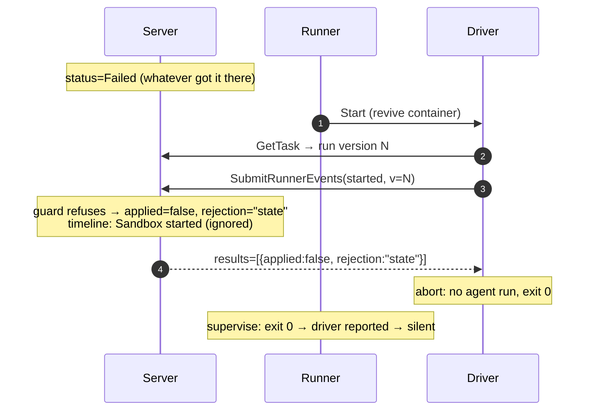

# Run-Scoped Runner Events with Explicit Rejection

Issue: https://github.com/icholy/xagent/issues/1052

## Problem

When `Task.ApplyRunnerEvent` rejects a runner event, `SubmitRunnerEvents`
(`internal/server/apiserver/runner.go`) skips the status update *and* the
lifecycle-event write, but still acks the RPC as success. A rejected event is
therefore indistinguishable from an applied one:

1. **The driver can't react.** `Driver.submit` (`internal/agent/driver.go`)
   only treats a transport error as failure, so a driver whose `started` was
   rejected happily runs the agent anyway (issue's Manifestation A — the
   orphaned run that kept updating a PR while the server said `Failed`), and a
   driver whose terminal event was rejected exits 0, silencing the runner's
   `supervise` backstop.
2. **The timeline lies.** No lifecycle event is written, so the run's real
   "Sandbox exited" never appears (Manifestation B's "Missing exited event")
   and the status can stay a stale `Running` with no live container.
3. **Version 0 clobbers.** The driver hardcodes `Version: 0` for all events,
   and the runner's `supervise` / `Load` backstops emit `failed` with version 0
   (`internal/runner/runner.go`). Version 0 bypasses the guard in
   `ApplyRunnerEvent`, so a stale exit from a dead run can flip a newer run to
   `Failed` — which is what put task 951 into the state that rejected the live
   container's `started` in the first place.

The issue was written against the old `Monitor`/`Reconcile` runner; those are
now `supervise` (per-handle `backend.Wait`) and `Load` (boot-time rehydration
with `failIfTaskRunning`), but both still emit version-0 `failed` events, and
the silent-ack behavior is unchanged. The root causes survive the refactor.

## Design

The design has two halves that only work together:

- **Explicit rejection**: `SubmitRunnerEvents` returns a per-event verdict, and
  rejected events are still recorded in the task's timeline.
- **Run-scoped versions**: every event carries the version of the run that
  emitted it, and the version bumps exactly when a new run is provisioned — so
  "rejected because stale" (expected, e.g. the old run's `stopped` during a
  restart) is distinguishable from "rejected because the state machine refused"
  (an anomaly worth surfacing).

Without versions, the driver cannot tell an expected rejection from a desync;
without the verdict, the driver cannot react at all.

### 1. `ApplyRunnerEvent` returns a verdict, not a bool

```go
// model/task.go
type RunnerEventVerdict int32

const (
    RunnerEventApplied       RunnerEventVerdict = iota // task mutated
    RunnerEventRejectedStale                           // e.Version != 0 && e.Version != t.Version
    RunnerEventRejectedState                           // the status/command guard refused
)

func (t *Task) ApplyRunnerEvent(e *RunnerEvent) RunnerEventVerdict
```

Pure refactor of the existing bool: the `Reconcile` short-circuit and unknown
event types map to `RunnerEventRejectedState`, the version guard to
`RunnerEventRejectedStale`, and the three `applyRunnerEvent*` folds keep their
logic. Existing `model/task_test.go` cases update mechanically.

### 2. `SubmitRunnerEventsResponse` reports the verdict

```proto
message RunnerEventResult {
  bool applied = 1;
  // Why the event was not applied. Empty when applied.
  // "stale": the event's version predates the current run.
  // "state": the state machine refused the transition at the current version.
  string rejection = 2;
}

message SubmitRunnerEventsResponse {
  // 1:1 with SubmitRunnerEventsRequest.events.
  repeated RunnerEventResult results = 1;
}
```

Adding a field to an empty response is wire-compatible. Clients must treat
`len(results) != len(events)` as "legacy server: assume applied" so a new
driver against a not-yet-deployed server behaves exactly as today.

The runner's outbox `Deliver` closure (`internal/runner/eventoutbox.go`) is
unchanged: a rejection is still a successful delivery (the server durably
decided), not a retryable error — this is why the verdict is a response field
and not an RPC error.

### 3. Rejected events are recorded in the timeline

In `SubmitRunnerEvents`, the `!applied` branch stops returning silently.
It writes the same sandbox lifecycle event the applied branch would
(`RunnerEvent.LifecycleEvent`), marked as ignored:

```proto
message LifecyclePayload {
  // ...existing fields...
  // The runner event that produced this entry was rejected by the task state
  // machine; the entry records that the sandbox transition happened, but the
  // task status was not changed by it.
  bool ignored = 7;
}
```

For an ignored entry `from_status == to_status` (no transition) and `message`
carries the reason, e.g. `event from run 4 superseded (task at run 5)` or
`status Failed does not admit "started"`. The notification for a rejected
event keeps only the `task_logs`/`appended` resource (the task row did not
change) instead of today's `Ignore = true` suppression.

This directly fixes Manifestation B's "Missing exited event": every real
sandbox exit now appears in the timeline, applied or not, so started/exited
pairs are always complete. It also gives every restart an honest "Sandbox
exited (ignored: superseded)" entry for the old run.

### 4. Version = run identity

Today `Task.Version` bumps on `Cancel` (running/restarting), `Restart`,
`Start`, and the zombie-kill paths in `applyRunnerEventStarted`
(archived/cancelled → `Cancelling+stop`). Those bumps are inert in practice —
drivers send version 0 — and two of them would *break* under run-scoped
events:

- **Cancel**: the live driver's SIGTERM-induced `stopped` carries the run's
  version N; with the bump the task is at N+1, the `stopped` is rejected as
  stale, and the task wedges in `Cancelling` forever.
- **Zombie kill**: same shape — the zombie's `stopped` must land the task in
  `Cancelled`, so the version it started at must remain current.

New rule: **the version bumps exactly when a new run is provisioned** —
`Restart` and `Start` keep their `t.Version++`; `Cancel` and the
`applyRunnerEventStarted` archived/cancelled paths drop theirs. Stopping the
current run is not a new run; the current run's terminal event must still
apply.

This is safe for the version's other consumer: the archiver's change-fence
(`internal/server/archiver/archiver.go:117`) only lists terminal tasks, which
`CanCancel` excludes, and its `task.Archive()` re-validates `CanArchive`
inside the transaction regardless.

With this rule, after the whole stack lands, the only same-version
state-guard rejections left are genuine anomalies (something flipped the state
out from under the current run) — exactly the thing worth a loud timeline
entry.

### 5. The runner scopes its backstop events to the run that exited

`taskstate.Record` gains the run's version:

```go
type Record struct {
    TaskID  int64  `json:"task_id"`
    Version int64  `json:"version,omitempty"` // task.Version at launch
    // ...Type, ID, Data unchanged...
}
```

`Runner.Start` stamps `task.Version` into the record it already writes before
spawning `supervise`. Then:

- `supervise` emits its lost-report `failed` with the record's version instead
  of 0.
- `Load`'s `failIfTaskRunning` emits `failed` with the record's version.

A `failed` scoped to run N cannot clobber run N+1 — the server rejects it as
stale and records an ignored timeline entry instead. This kills Manifestation
A's trigger (the version-0 `failed` that flipped a live run to `Failed`), and
it *is* the issue's "Reconcile should not blindly mark failed a task it is
about to revive": if the task was re-commanded while the runner was down
(version bumped), the boot-time `failed` for the dead old run is stale by
construction. Records written by older runners have `Version: 0` and degrade
to today's bypass behavior.

The two `Poll` emits that already carry `task.Version` (the no-sandbox
`stopped` in the stop branch, the dispatch-failure `failed`) are already
correctly scoped and stay as they are.

### 6. The driver scopes its events and reacts to rejection

`Driver.Run` reorders slightly: fetch the task first (it already calls
`GetTask` for the shell-session fork), remember `task.Version` as the run's
version, and stamp it on all three events.

- **`started` rejected** (stale or state): the server does not want this run.
  Log loudly, skip the agent entirely, exit 0 — the rejection was durably
  recorded server-side (§3), so the driver has "reported" per the
  driver-owned-events invariant, and `supervise` stays correctly silent. This
  is the fix for the orphaned run: the container stops instead of doing work
  the server will never acknowledge.
- **terminal event rejected as `stale`**: expected (a restart/start
  superseded this run — today's intentional restart-flow rejection). Exit 0,
  as today.
- **terminal event rejected as `state`**: an anomaly, but one the server has
  now recorded. Exit 0 as well — exiting non-zero would only make `supervise`
  emit a same-version `failed` that meets the same guard (see Open Questions).

Why `GetTask` rather than a `--version` flag in the sandbox spec: the Docker
backend's adopt path (`internal/runner/backend/docker/docker.go`) reuses the
existing container without refreshing `Cmd`, `Env`, or `Files`, so a flag
would be permanently stale for every reused container. `GetTask` works
uniformly across fresh and adopted sandboxes and across backends. The window
between the runner's launch decision and the driver's read is benign: a bump
in that window means the run was superseded before it started, and the
versioned `started` is rejected — which is the correct outcome.

### 7. The start command probes instead of trusting the status

`Poll`'s start branch currently early-returns when `task.Status == Running`
("wait for it to finish"). Under run-scoped events that deadlocks the
start-while-running flow: run N's `stopped` arrives stale (Start bumped to
N+1), the status stays `Running`, and the old `Running+start → Pending`
re-queue in `applyRunnerEventStopped` never fires.

Drop the early return and let the existing probe decide: sandbox running →
wait; sandbox not running → `Start` a new run. The new driver's `started`
(version N+1) lands via the existing `Running`+`Start` → `Running`+`None` arm
of `applyRunnerEventStarted`. The `Running+start → Pending` re-queue arm stays
for legacy version-0 drivers.

This also un-wedges Manifestation B's stuck state on its own: a task at a
stale `Running` with `command=start` and no live sandbox gets started on the
next poll instead of waiting forever, and it cannot double-run — a live
sandbox still probes as running.

## How the manifestations are fixed

**Task 951 (orphaned run):** the boot-time `failed` is scoped to the dead
run's version (§5) so it can no longer flip a task that was re-commanded; if a
`started` is rejected anyway, the driver aborts instead of running the agent
(§6), and the rejection is visible in the timeline (§3).



**Task 954 (lost exited event / double run):** the rejected `stopped` still
writes "Sandbox exited (ignored)" (§3); a genuinely stale `Running` is
self-corrected by `supervise`'s now-applying same-version `failed` (§5); and
the start branch revives from a probe, not the stale status (§7), so one
instruction produces exactly one run.

## Implementation Plan

1. **Model: `ApplyRunnerEvent` verdict** — Delivers: the
   `RunnerEventVerdict` type and the bool→verdict refactor with updated
   `task_test.go` cases. Depends on: nothing. Verifiable by: existing state
   machine tests, extended to assert stale-vs-state.
2. **Proto + server: per-event results** — Delivers: `RunnerEventResult` /
   `results` on `SubmitRunnerEventsResponse`, populated by
   `SubmitRunnerEvents`. Depends on: (1). Verifiable by: handler tests
   asserting `applied`/`rejection` per event; old clients unaffected (empty
   struct gained a field).
3. **Server: record rejected events** — Delivers: the `ignored` field on
   `LifecyclePayload` (proto + model) and the `!applied` branch writing the
   ignored lifecycle event with a reason message, publishing the
   `task_logs`-only notification. Depends on: (1), (2). Verifiable by:
   handler tests asserting the timeline entry for a rejected event; UI shows
   "Sandbox exited" entries for superseded runs.
4. **Model: version-bump realignment** — Delivers: `Cancel` and the
   `applyRunnerEventStarted` zombie paths stop bumping `Version`;
   `Restart`/`Start` keep it. Depends on: nothing (inert while all events are
   v0), but must land **before** (5) and (6). Verifiable by: state machine
   tests; a versioned cancel round-trip test (cancel → driver `stopped` at
   the pre-cancel version → `Cancelled`).
5. **Runner: run-scoped backstop events** — Delivers: `taskstate.Record.Version`,
   stamped in `Start`; `supervise` and `failIfTaskRunning` emit `failed` with
   the record's version. Depends on: (4). Verifiable by: runner tests — a
   `failed` for an exited run does not apply after a restart bumped the
   version; version-0 legacy records still bypass.
6. **Driver: versioned events + rejection handling** — Delivers: `GetTask`
   before `started`, run version on all events, abort-on-rejected-`started`,
   legacy guard for empty `results`. Depends on: (2), (4). Verifiable by:
   driver tests against a fake client — rejected `started` runs no agent and
   exits 0; rejected terminal event exits 0; empty results behaves as applied.
7. **Runner: probe-driven start branch** — Delivers: `Poll`'s start branch
   drops the `Status == Running` early return. Depends on: (5)/(6)
   conceptually, safe standalone. Verifiable by: runner test — task at stale
   `Running` with `command=start` and an exited sandbox gets started; a live
   sandbox does not.

Deploy order: the server (1–4) ships before runners (5–7); the runner binary
embeds the prebuilt driver so (5)–(7) roll out together. The empty-results
legacy guard in (6) makes the ordering non-critical.

## Trade-offs

- **Minimal fix only (applied bit, driver fails on rejection).** Without
  version scoping, the driver cannot distinguish the *intentional* rejection
  of the old run's `stopped` during a restart from a real desync — and exiting
  non-zero on rejection would make `supervise` emit a version-0 `failed` that
  clobbers the new run: the exact bug being fixed. The verdict and the
  versions have to land together.
- **RPC error instead of a response field.** A typed error per rejected event
  would poison the batch semantics, and the runner's outbox would classify it
  for retry/dead-letter — but a rejection is a durable server decision, not a
  delivery failure. A response field keeps delivery and application separate.
- **A dedicated run ID (UUID/serial) instead of `Version`.** Cleaner identity
  semantics, but it needs a new column, spec plumbing into both backends, and
  a parallel guard in the state machine. After the bump realignment (§4),
  `Version` already changes at exactly the new-run boundaries, so it serves as
  the run identity without new schema.
- **Passing the version via the sandbox spec instead of `GetTask`.** Rejected
  because the Docker adopt path reuses containers without refreshing
  `Cmd`/`Env`/`Files`; a baked flag would be wrong for every reused container.
- **Timeline noise.** Every restart now produces an ignored "Sandbox exited"
  entry for the old run. This is judged signal, not noise — it completes the
  started/exited pairing the UI already checks for ("Missing exited event"),
  and the `ignored` flag lets the UI de-emphasize it.

## Open Questions

- Should a **same-version state-guard rejection of a terminal event** make the
  driver exit non-zero? It would trigger `supervise`'s `failed` as a second
  opinion, but that event faces the same guard; exit 0 + the recorded ignored
  entry may be enough. Proposed: exit 0, revisit if desyncs recur.
- Should the web UI render `ignored` lifecycle entries dimmed / badged, and
  should the "Missing exited event" annotation treat an ignored exit as
  closing the pair? (Follow-up webui slice, not in the plan above.)
- `RunnerEvent.Reconcile` is dead — nothing sets it and `ApplyRunnerEvent`
  rejects it wholesale. Fold its removal into layer (1), or leave it?
