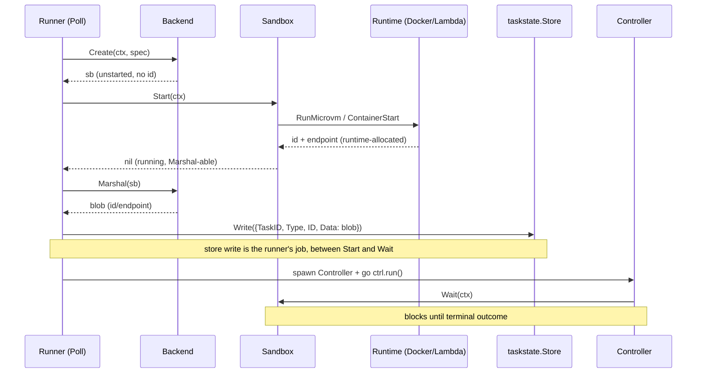
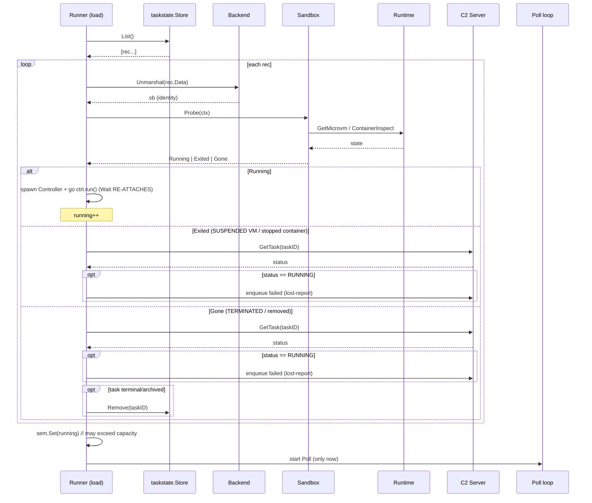
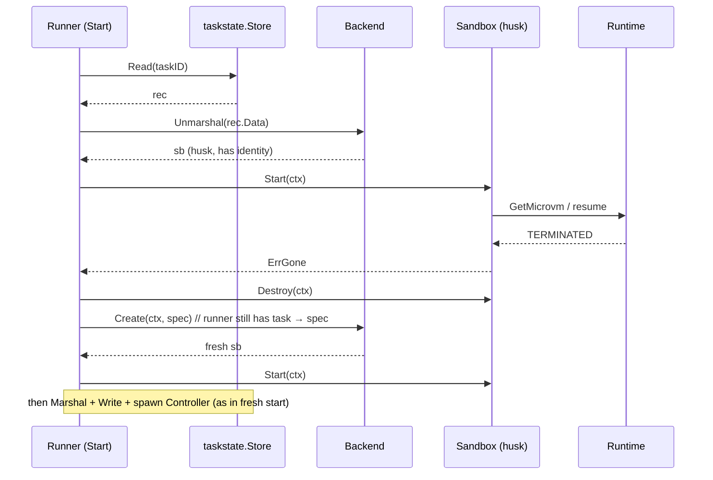

# Task-Oriented Sandbox Interface

Issue: https://github.com/icholy/xagent/issues/1089

> This proposal covers **#1088 bug 1** only — the backend interface/ownership
> rethink and the backends + runner rewiring it forces. It builds directly on
> `proposals/draft/shared-runner-taskstate.md` (the runner-owned `taskstate`
> store) and `proposals/accepted/runner-backend-interface.md` (the original
> Docker-only seam). #1088 bugs 2 (`NO_INGRESS`), 3 (shim hook port), and 4
> (image build recipe) are out of scope; bug 2 is noted below as a *runtime
> prerequisite* for `Wait`, but it is a launch-config change, not an interface
> change.
>
> This is a design document. Nothing here is implemented; an in-progress,
> non-compiling sketch of the new interfaces already exists in
> `internal/runner/backend/backend.go` and the "Resolving the WIP sketch"
> section below says exactly what to do with it.

## Problem

The current backend interface (`internal/runner/backend/backend.go`) is
**fleet-oriented**. One global `Backend.Watch(ctx, func(HandleExit))` stream
emits opaque handle *ids*, and the runner's `Monitor` (`runner.go:494`)
reverse-resolves each id back to a task via `taskstate.Store.ByID`
(`taskstate.go:168`). The Docker backend gets that stream for free from `docker
events` (`docker.go:309`). The Lambda backend has no equivalent, so
`lambdamicrovm.Watch` (`lambdamicrovm.go:442`) *manufactures* one: a `watcher`
(`lambdamicrovm.go:468`) that lists every MicroVM (`listAll`,
`lambdamicrovm.go:400`), **tag-filters** to find its own
(`m.Tags[tagRunner] != w.b.runnerID`, `lambdamicrovm.go:497`), maintains an SSE
stream per VM, and dedups exits across streams with `watcher.{streams, states,
reported}` (`lambdamicrovm.go:474-483`).

Per #1088, that ownership/discovery model is **unimplementable against the real
Lambda MicroVMs API**:

- `run-microvm` takes no tags; `get-microvm`/`list-microvms` return no tags. A
  running MicroVM is not a taggable resource, so the `tagRunner` filter in
  `sweep` matches **nothing** in production — it is exercised only by the test
  fakes (`fakes_test.go`).
- `list-microvms` items carry no `endpoint`, so even a "discovered" VM cannot be
  streamed without a `GetMicrovm` per id (`lambdamicrovm.go:221`).

There is therefore **no owner-scoped fleet query at all**. The Lambda runner
never learns of a driver exit, never performs the suspend-on-exit, and never
reconciles. The whole `Watch`→`ByID` machinery is dead weight on Lambda and a
liability (the `launchMu` lost-exit race, below) on Docker.

### The enabling invariant

The fix flips the orientation around the one fact that is actually true on every
runtime:

> **The runner-local `taskstate` statefile is the *only* owner-scoped
> enumeration of this runner's sandboxes that exists.** Docker *could* enumerate
> via labels; Lambda *cannot*. So we treat the runtime as a **per-id liveness
> oracle only — never an enumerator** — and let the statefile answer "what is
> mine".

| | Old (fleet) | New (task) |
|---|---|---|
| Discovery | one `Watch` stream → N opaque ids | `store.List()` → N records |
| Liveness | reverse-resolve id→task, dedup | per-id `Probe`/`Wait` that **already knows its task** |
| Exit signal | global callback, `store.ByID` | per-sandbox `Wait` goroutine spawned by the runner |

## Design

### Overview

Replace the `Handle`-and-`Watch` backend with a **live `Sandbox` object per
task**, persisted via `Backend.Marshal`/`Unmarshal` and driven by a blocking
`Sandbox.Wait` running in its own goroutine. The runner owns a
`map[taskID]*Controller`; a Controller exists **iff** a sandbox is running on
this runner, and its goroutine is the single place an exit is observed for that
task. There is no global stream and no id→task reverse lookup anymore.

The `taskstate` store keeps its exact on-disk shape (`<dir>/<id>.json`, atomic
write) and its `{TaskID, Type, ID, Data}` `Record`, but `Data` now holds the
**marshalled `Sandbox` blob** instead of an opaque handle payload. `ID` stays a
**schema-stable top-level field** — a binary-upgrade-proof terminate key — and
`Store.ByID` is deleted.

### The new `Sandbox` interface

```go
// ExitCode is the driver process's exit status as observed by the runtime.
// 0 means the driver reported its own terminal outcome (driver-owned-events);
// a non-zero / sentinel value means the report was lost and the runner must
// emit "failed" on the driver's behalf.
type ExitCode int

// ExitLost is the sentinel Wait returns when a sandbox went terminal without a
// clean driver-exited report (stream gone, VM TERMINATED unexpectedly, a
// rehydrated-already-dead sandbox).
const ExitLost ExitCode = -1

// Sandbox is a live handle to one task's sandbox. It is created by the backend
// (Create / Unmarshal) and driven by the runner. It carries the runtime
// identity (Docker container id; Lambda microvmId + endpoint + staging key)
// once Start has run or it was rehydrated from a persisted blob.
type Sandbox interface {
	// Start brings this (identified) sandbox up — a fresh launch, or a resume of
	// a suspended/exited one, decided internally — and returns once it is
	// running and Marshal() yields a blob carrying the runtime-allocated
	// id/endpoint. Returns ErrGone if a rehydrated sandbox can no longer be
	// resumed (its VM was TERMINATED / its container removed); the runner then
	// destroys the husk and Creates a fresh sandbox from the spec.
	Start(ctx context.Context) error

	// Wait blocks until a terminal outcome, returning exactly once. It swallows
	// all transient failures internally (SSE drops, token re-mint,
	// reconnect/arbitrate, backoff). For Lambda it performs the
	// suspend-on-driver-exit before returning. See "The Wait contract".
	Wait(ctx context.Context) (ExitCode, error)

	// Probe answers liveness for this sandbox's id synchronously — the loader's
	// startup re-derivation. It does not stream and does not block.
	Probe(ctx context.Context) (State, error)

	// Signal gracefully stops the sandbox (SIGTERM → SIGKILL / terminate),
	// reporting whether a running sandbox was signalled — in that case the
	// driver owns the terminal event report.
	Signal(ctx context.Context) (signalled bool, err error)

	// Destroy deletes the sandbox. Idempotent: destroying an absent sandbox is
	// not an error.
	Destroy(ctx context.Context) error

	// Close releases the Sandbox's local resources (open SSE clients, cancel
	// funcs) without touching the remote sandbox.
	Close() error
}

var ErrGone = errors.New("sandbox is gone")
```

#### Why `Start` and `Wait` are split (not one blocking `Run`)

A single `Sandbox.Run(ctx)` that both starts and waits was considered and
rejected for two hard constraints, both rooted in **the runner being the only
writer of `taskstate`**:

1. **Identity is runtime-allocated at start and must be persisted between the two
   phases.** The Lambda `microvmId` does not exist until `RunMicrovm` returns
   (`lambdamicrovm.go:275`), and it is the *only* handle to that VM (no tags, no
   other index). It must be written to the store the instant it is allocated. If
   `Run` did the launch internally, the persist point would be buried mid-`Run`,
   reachable only via a store-writer callback handed into the backend —
   violating the "backends never touch taskstate" layering that
   `shared-runner-taskstate.md` established.
2. **Resume mutates the endpoint — a second mandatory re-persist seam.** Today's
   `tryResume` does `hd.Endpoint = mvm.Endpoint` (`lambdamicrovm.go:244`). The
   rehydrated `Start` re-allocates the endpoint, so the runner must re-`Marshal`
   and re-`Write` after `Start` returns on the resume path too.

The clean seam is therefore: synchronous `Start` returns once the sandbox is up
and `Marshal`-able → **the runner writes the store** → blocking `Wait`. The
runner's store write sits *between* the two calls, in the one place that is
allowed to write it.

The issue's `Run(ctx, checkpoint func([]byte) error)` variant (runner passes its
store-writer in) also preserves layering, but buries the "started and committed"
seam in a callback and makes start-failure-vs-exit harder to distinguish. The
explicit two-phase split is preferred for this codebase.

#### The `Wait` contract (the load-bearing part)

`Wait` returns **exactly once**, only on a terminal outcome or ctx cancel. Three
outcomes, and the Controller branches on all three:

1. **Clean driver exit** → `(code, nil)`. Lambda performs the suspend *before*
   returning (it is the runner, not the guest, that holds AWS creds — see Open
   Questions); the orchestrator only ever sees an exited/preserved sandbox. The
   Controller releases its slot and, because the driver already reported, emits
   **nothing** on `code == 0`.
2. **Lost / unknown** (stream gone, VM went terminal unexpectedly) → `ExitLost` /
   `-1` → the runner emits `failed`. **A rehydrated-already-dead sandbox returns
   this immediately**, which is exactly how the startup loader absorbs the old
   `Reconcile` lost-report backstop (`runner.go:287-295`) without a separate code
   path.
3. **ctx cancelled** → `(_, ctx.Err())`. Means **the runner is shutting down**,
   *not* that the sandbox exited. The sandbox keeps running and is rehydrated
   next boot; the Controller must **not** emit `failed` on this path. Conflating
   "I stopped watching" with "it stopped running" would spuriously fail every
   task on a clean restart.

`Wait` **swallows all transient failures internally**: SSE drops, token re-mint,
reconnect, the drop→`GetMicrovm`→arbitrate loop (today's `watcher.stream`,
`lambdamicrovm.go:590`), and backoff. None of those surface to the runner — they
are not terminal outcomes.

### The new `Backend` interface

```go
//go:generate go tool moq -out backend_moq.go . Backend Sandbox

type Backend interface {
	// Create builds a fresh, UNSTARTED Sandbox for spec. It allocates no remote
	// resources; the runner calls sb.Start() next.
	Create(ctx context.Context, spec *Spec) (Sandbox, error)

	// Marshal serializes a Sandbox's runtime identity to the blob the runner
	// persists in taskstate.Record.Data.
	Marshal(sb Sandbox) ([]byte, error)

	// Unmarshal rehydrates a Sandbox from a persisted blob. The result has
	// identity (id/endpoint) but is not "running" until Probe/Wait/Start says so.
	Unmarshal(data []byte) (Sandbox, error)

	// ValidateWorkspace reports whether the workspace's runtime config is usable
	// by this backend.
	ValidateWorkspace(ws *workspace.Workspace) error

	Close() error
}
```

`Create` returns an unstarted `Sandbox` (no id yet); `Start` allocates identity;
`Marshal`/`Unmarshal` move that identity in and out of the store. `Marshal`
persists **identity, not the spec**, which is why resume-from-scratch is a runner
concern (see "Resume / ErrGone"). `backend_moq.go` must be regenerated to cover
both `Backend` and the new `Sandbox` interface.

### `State` grows a `StateGone` value

Today `backend.State` is `{StateUnknown, StateRunning, StateExited}`
(`backend.go:71-75`). The loader must distinguish a sandbox whose **husk still
exists** (stopped container / SUSPENDED VM — keep the record, `Wait` can
re-attach) from one where **nothing is left** (removed container / TERMINATED via
`max_duration` reap — drop the record). So a fourth value is **required**:

```go
const (
	StateUnknown State = iota
	StateRunning
	StateExited // husk present: stopped container / SUSPENDED VM
	StateGone   // nothing left: removed container / TERMINATED VM
)
```

### `taskstate.Record` — `Data` becomes the marshalled Sandbox; `ID` stays top-level

The store keeps its file layout, atomic `Write`, `Read`, `Remove`, and `List`
verbatim. Two changes:

**Record schema — before:**

```go
// Data is the opaque backend handle payload; ID is the reverse-index key.
type Record struct {
	TaskID int64           `json:"task_id"`
	Type   string          `json:"type"`           // "docker", "lambda-microvm"
	ID     string          `json:"id"`             // reverse-index key (Store.ByID)
	Data   json.RawMessage `json:"data,omitempty"` // opaque backend handle Data
}
```

**Record schema — after:**

```go
// Data is now the marshalled Sandbox blob (backend.Marshal(sb)). ID is no
// longer a reverse-index key — it is a schema-stable, blob-independent
// terminate key (see "Blob schema drift").
type Record struct {
	TaskID int64           `json:"task_id"`
	Type   string          `json:"type"`           // backend selector for the terminate path
	ID     string          `json:"id"`             // runtime id; survives a Data schema bump
	Data   json.RawMessage `json:"data,omitempty"` // == backend.Marshal(sb); rehydrated by Unmarshal
}
```

The fields are unchanged on the wire; their **meaning** changes. Why keep `ID` as
a top-level field even though nobody reverse-resolves id→task anymore?

> **Blob schema drift across a binary upgrade.** If a newer binary's
> `Unmarshal` cannot parse an older `Data` blob, the Lambda `microvmId` *inside*
> that blob is the only handle to a possibly-hot VM → an **unkillable orphan**.
> Keeping `ID` as a schema-stable top-level field means the loader can always
> fall back to a direct `Destroy(Type, ID)` even when `Data` won't parse. The
> *use* of `ByID` (the `map[string]int64` reverse lookup) dies; the top-level
> `ID` *field* stays as a last-resort terminate key.

`taskstate.Store.ByID` (`taskstate.go:168`) is **deleted** — the Controller
always already knows its task, so nothing resolves id→task.

### Runner-side management: a Controller per running sandbox

The runner gains `controllers map[int64]*Controller` under a mutex. A Controller
exists **iff** the sandbox is running on this runner; it owns the `Wait`
goroutine and the in-memory truth of "what is running here":

```go
type Controller struct {
	taskID int64
	sb     backend.Sandbox
	cancel context.CancelFunc
}

// run blocks on Wait and reacts to its single return. Spawned after the runner
// has persisted the sandbox.
func (c *Controller) run(ctx context.Context, r *Runner) {
	code, err := c.sb.Wait(ctx)
	if errors.Is(err, context.Canceled) {
		return // runner shutdown: leave the sandbox alive for next-boot rehydration
	}
	r.mu.Lock()
	delete(r.controllers, c.taskID)
	r.mu.Unlock()
	r.sem.Release(1)
	r.wake.Wake()
	if code != 0 { // includes ExitLost
		r.queue.Enqueue(model.RunnerEvent{TaskID: c.taskID, Event: model.RunnerEventFailed})
	}
}
```

Because this map is the authoritative "what's running here":

- `Running(taskID)` becomes an **in-memory map lookup**, not a `Probe` RPC
  (`runner.go:313` collapses to `_, ok := r.controllers[taskID]`).
- `Start`'s already-running check (`runner.go:450-461`) becomes the same map
  lookup.
- `Probe` shrinks to a **startup-only** liveness re-derivation (the loader). It
  is no longer on any steady-state path.

### The loader — replaces *both* `Reconcile` and the boot duty of `Monitor`/`Watch`

A single `load(ctx)` runs **once at boot, before `Poll` admits new work**. It is
the merger of today's `Reconcile` (`runner.go:255`) and the startup half of the
global `Monitor`/`Watch` goroutine (`command/runner.go:220-237`). The statefile
enumerates; the runtime answers liveness per id:

```go
func (r *Runner) load(ctx context.Context) error {
	records, err := r.store.List()
	if err != nil {
		return err
	}
	var running int64
	for _, rec := range records {
		sb, err := r.backend.Unmarshal(rec.Data) // identity, not liveness
		if err != nil {
			// Blob drift: fall back to the schema-stable id to terminate.
			r.destroyByID(ctx, rec) // see "Blob schema drift"
			continue
		}
		state, err := sb.Probe(ctx) // re-derive liveness per id
		if err != nil {
			r.log.Error("probe failed at load", "task", rec.TaskID, "error", err)
			continue
		}
		switch state {
		case backend.StateRunning:
			r.spawnController(ctx, rec.TaskID, sb) // Wait RE-ATTACHES
			running++
		case backend.StateExited: // stopped container / SUSPENDED VM — keep record
			r.lostReportIfTaskRunning(ctx, rec.TaskID)
		case backend.StateGone: // removed / TERMINATED — drop record if task terminal
			r.lostReportIfTaskRunning(ctx, rec.TaskID)
			r.dropRecordIfTaskArchived(ctx, rec.TaskID)
		}
	}
	r.sem.Set(running) // may exceed capacity; that's fine
	return nil
}
```

Only after `load` returns does `command/runner.go` enter the `Poll` loop. Two
design choices to call out:

- **`Wait` re-attaches.** On the `StateRunning` branch the spawned Controller's
  `Wait` attaches to a sandbox **this process did not start**. Docker's
  `ContainerWait` gives this for free; the Lambda shim must hold/replay the last
  lifecycle event so a re-attached `Wait` still observes a sticky
  `driver-exited` (see Open Questions).
- **Probe-then-branch beats "spawn `Wait` for everything".** Probing first
  yields a **synchronous running-count** for `sem.Set`, and avoids opening a
  doomed SSE stream per *dead* VM — `Wait` is only spawned for sandboxes Probe
  says are alive.

### Resume / `ErrGone`

`Marshal` persists identity, not the spec, so a rehydrated `Sandbox` cannot
re-create itself from scratch — but the runner still has `task → spec`. So the
runner's `Start` path becomes:

```go
func (r *Runner) Start(ctx context.Context, task *model.Task) error {
	if rec, ok, _ := r.store.Read(task.ID); ok {
		sb, err := r.backend.Unmarshal(rec.Data)
		if err == nil {
			if err := sb.Start(ctx); err == nil {
				return r.commit(ctx, task.ID, sb) // re-Marshal (endpoint moved) + Write + spawn Controller
			} else if !errors.Is(err, backend.ErrGone) {
				return err
			}
			_ = sb.Destroy(ctx) // ErrGone: husk is unrecoverable, fall through to fresh
		}
	}
	spec, err := r.spec(ctx, task)
	if err != nil {
		return err
	}
	sb, err := r.backend.Create(ctx, spec) // fresh, unstarted
	if err != nil {
		return err
	}
	if err := sb.Start(ctx); err != nil {
		return err
	}
	return r.commit(ctx, task.ID, sb)
}
```

`commit` is the one store-writer seam: `data := backend.Marshal(sb); store.Write({TaskID, Type, ID: sb.ID(), Data: data})`,
then `spawnController`. The Controller's `Wait` is spawned only **after** the
record is persisted — see "Two races".

### What this deletes

- `Backend.Watch` and the **entire `lambdamicrovm.watcher`** (`sweep`,
  `listAll`, the per-VM stream goroutines, the `streams`/`states`/`reported`
  maps, the `tagRunner` tag filter — `lambdamicrovm.go:397-600`). The
  drop→arbitrate logic in `watcher.stream` moves *into* `Sandbox.Wait`.
- `taskstate.Store.ByID` (`taskstate.go:168`) — nobody resolves id→task anymore.
- `launchMu` (`runner.go:39`) and the create-then-record **lost-exit race**:
  `Wait` is level-triggered and spawned *after* the record is persisted, so an
  exit in that window is observed by the re-attaching `Wait`, not dropped.
- `Reconcile` as a standalone method (`runner.go:255`) — folds into `load`.
- The global `Monitor` goroutine (`runner.go:494`, `command/runner.go:220-232`).
- The old point-in-time `backend.Sandbox` struct (`backend.go:80`),
  `backend.Handle`/`HandleExit`/`backend.Exit` — all dead.

### What relocates (being honest — not eliminated)

- The **per-VM goroutine map** moves from `watcher.streams` (inside the Lambda
  backend) to the runner's `map[taskID]*Controller`. A better home (uniform
  across backends), but still lifecycle state with a `Close` to own.
- The reconcile-sweep's **real job** — catch a VM that went terminal while
  disconnected — moves into `Wait`'s own drop→`GetMicrovm`→arbitrate loop plus
  the startup re-attach. You stop needing to *list* to find who to check.
- **Semaphore seeding** still needs a `Probe` per record at startup (the loader).

### Two races — kept separate

- **Lost-exit race** (today's `launchMu` + `ByID`): a sandbox exits before the
  runner is watching/recorded → the exit is dropped. **Eliminated** by
  level-triggered `Wait` + runner-controlled ordering (persist, *then* spawn
  `Wait`) + the Controller already knowing its task.
- **Orphan race** (crash between `RunMicrovm` returning and the post-`Start`
  persist): a leaked, untracked sandbox. **Inherent — it survives this design**,
  bounded by name-adoption on Docker (the deterministic `xagent-{taskID}` name
  the next `Start` adopts) and `max_duration` on Lambda. This model does **not**
  claim to fix it.

### Resolving the WIP sketch (`internal/runner/backend/backend.go`)

The uncommitted sketch does not compile. This proposal resolves each problem:

| WIP problem | Resolution |
|---|---|
| `Sandbox` declared twice — a struct (`~:80`, the old point-in-time view) and an interface (`~:94`) | Delete the struct; `Sandbox` is the interface. `runner.List`'s `[]Sandbox` view goes away with `Reconcile`/`List`. |
| `ExitCode` used but never defined | `type ExitCode int` with an `ExitLost = -1` sentinel. |
| WIP interface has `Probe` but no `Start`; the issue's "Proposed interfaces" lists `Start` but omits `Probe` | The interface needs **both**: `Start` (identity is runtime-allocated at start) **and** `Probe` (the loader needs a synchronous liveness answer). |
| `Handle` / `HandleExit` / `Exit` / `State` plumbing | Prune `Handle`/`HandleExit`/`Exit`; keep `State` and **add `StateGone`**. |

### Diagram: fresh task start



### Diagram: clean driver exit + Lambda suspend

```mermaid
sequenceDiagram
    participant Ctrl as Controller
    participant SB as Sandbox (Wait)
    participant RT as Lambda
    participant ST as taskstate.Store
    participant C2 as C2 Server

    Note over Ctrl,SB: ctrl.run() is blocked in sb.Wait(ctx)
    RT-->>SB: SSE: driver-exited{code:0}
    SB->>RT: SuspendMicrovm (runner-driven; guest has no creds)
    RT-->>SB: suspended
    SB-->>Ctrl: (0, nil)
    Ctrl->>Ctrl: delete(controllers, taskID)
    Ctrl->>Ctrl: sem.Release(1); wake()
    Note over Ctrl,C2: code == 0 → driver owns the report → emit NOTHING
    Note over ST: record stays on disk (husk = SUSPENDED VM), reusable on restart
```

### Diagram: startup / loader rehydration



### Diagram: runner shutdown

```mermaid
sequenceDiagram
    participant Main as command/runner (ctx)
    participant Ctrl as Controller(s)
    participant SB as Sandbox (Wait)
    participant ST as taskstate.Store
    participant C2 as C2 Server

    Main->>Ctrl: ctx cancel (cancel all Controllers)
    Ctrl->>SB: (Wait observes ctx.Done())
    SB-->>Ctrl: (_, ctx.Err())
    Note over Ctrl: errors.Is(err, context.Canceled) → return early
    Note over Ctrl,C2: NO failed emitted (sandbox did NOT exit)
    Note over SB,ST: sandbox left RUNNING; record persists for next-boot rehydration
```

### Diagram: resume / `ErrGone` fallback



## Trade-offs

**A live `Sandbox` object vs. the stateless `Handle` quartet.** The
`shared-runner-taskstate.md` design made backends stateless — pure functions over
a `Handle` the runner persists. This proposal reintroduces a stateful object
(open SSE clients, a `Wait` goroutine's internal reconnect state). That is the
price of making Lambda implementable at all: there is no fleet query, so the only
way to observe an exit is a per-sandbox stream, and a stream is inherently
stateful. The statefulness is **bounded** — `Marshal`/`Unmarshal` reduce the
durable part to identity, and `Close` owns the transient part — and it lives in a
uniform place (the runner's Controller map) rather than a backend-private map.

**Probe-then-branch loader vs. "spawn `Wait` for everything".** Spawning a `Wait`
per record would be simpler (one code path, live and rehydrated) but would open a
doomed SSE stream per dead VM and give no synchronous running-count for the
semaphore. Probing first is one extra `GetMicrovm`/`ContainerInspect` per record
at boot — cheap, and only at boot.

**`Start`/`Wait` split vs. one `Run`.** Covered above: the split exposes the two
mandatory store-write seams (post-launch identity, post-resume endpoint) without
a backend→store callback. The cost is a two-call protocol the runner must
sequence correctly; the benefit is the "backends never touch taskstate" layering
holds.

**Keeping the top-level `ID` after deleting `ByID`.** It looks vestigial — the
reverse index is gone — but it is the only blob-schema-drift escape hatch. A
versioned `Data` that a newer binary can't parse would otherwise strand a hot VM;
the schema-stable `ID` + `Type` lets the loader always terminate it. Cheap
insurance against an unkillable-orphan class of bug.

**Orphan race not fixed.** This design eliminates the lost-exit race but
explicitly leaves the orphan race (crash between `RunMicrovm` and persist). The
honest backstop is `max_duration` on Lambda and name-adoption on Docker, same as
`shared-runner-taskstate.md` already accepted.

## Open Questions

1. **Suspend-on-exit is runner-driven, so a hot-orphan window exists.** The guest
   holds no AWS creds, so a runner that dies *after* `driver-exited` but *before*
   the suspend leaves a VM hot until restart re-attaches `Wait`, reads a
   **sticky-replayed** `driver-exited`, and suspends. Two consequences:
   - `Wait` **must be safe to re-attach** to a sandbox this process didn't start.
     Docker's `ContainerWait` gives that for free; the Lambda shim must hold/replay
     the last lifecycle event (today's `EventDriverExited`,
     `lambdamicrovm.go:64`).
   - The hot-orphan window is bounded only by `max_duration` (hours;
     `defaultMaxDuration = 14400`, `lambdamicrovm.go:80`). **Reconsider whether
     omitting `idlePolicy` entirely is right** — its 600s idle floor can't express
     "never auto-suspend", but "auto-suspend after 10 min idle" is arguably the
     correct safety net for exactly this window.
2. **Blob schema drift across a binary upgrade.** Covered by the schema-stable
   top-level `ID`/`Type` terminate path, but the loader's `destroyByID` fallback
   needs a `Backend.DestroyByID(ctx, id string) error` (or equivalent) that does
   *not* require a parsed blob. Is a bare-id `Destroy` enough for Lambda (it needs
   only `microvmId` to `TerminateMicrovm`) and Docker (container id)? Believed
   yes; confirm against `awsmicrovm` cleanup, which today also wants the staging
   key (`Data`) for staged-object GC — an unparseable blob would leak the staged
   object but not the VM, an acceptable degradation.
3. **`StateGone` vs. `StateExited` boundary per backend.** Docker: not-found →
   `Gone`, exited/dead → `Exited`. Lambda: TERMINATED → `Gone`, SUSPENDED →
   `Exited`. Confirm `GetMicrovm` (`lambdamicrovm.go:311`) distinguishes these
   cleanly and that a max_duration-reaped VM reports TERMINATED (not absent).
4. **Shutdown drain ordering.** The sketch cancels all Controllers and relies on
   each `Wait` returning `ctx.Err()` quickly. Should `command/runner.go` join the
   Controller goroutines (a `WaitGroup`) before exit so an in-flight Lambda
   suspend completes, or is best-effort acceptable given the next-boot re-attach
   already handles a missed suspend?
5. **Runtime prerequisite (out of scope but blocking).** #1088 bug 2
   (`NO_INGRESS`) is a *launch-config* change, not an interface change, but `Wait`
   cannot reach the endpoint over the managed proxy without it. This proposal can
   land and compile, but the Lambda `Wait` path is untestable end-to-end until
   bug 2 is fixed.
