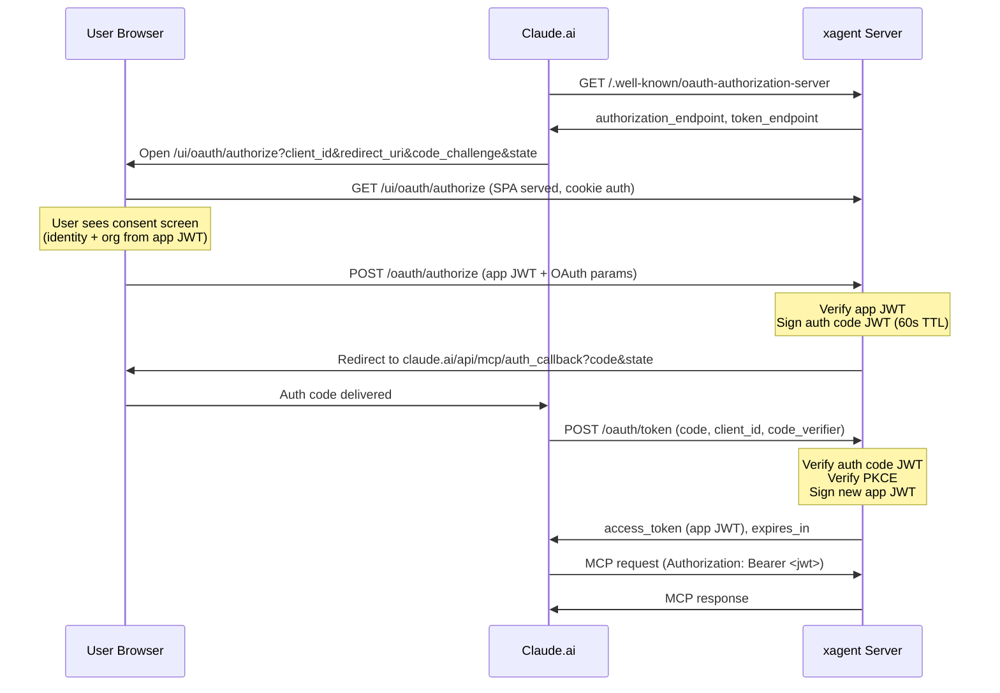

# OAuth 2.1 for MCP endpoint

- Status: pending
- Issue: https://github.com/icholy/xagent/issues/417

## Problem

The `/mcp` endpoint cannot be used as a Claude.ai custom connector because Claude.ai requires OAuth 2.1 authorization code flow with PKCE. The current auth mechanisms (API key with `X-Auth-Type` header, Zitadel Bearer tokens, cookie sessions) are not compatible with Claude.ai's connector UI.

## Design

### Overview

Implement a minimal OAuth 2.1 authorization server within xagent. The user is already logged into the xagent web UI and has an app JWT (from `/auth/token`) scoped to their selected org. The authorize page sends this JWT to the backend, which verifies it and issues an auth code. No API keys or cookie auth involved in the OAuth flow.

### Sequence Diagram



### New Routes

| Method | Path | Auth | Description |
|--------|------|------|-------------|
| GET | `/.well-known/oauth-authorization-server` | Public | RFC 8414 metadata |
| GET | `/.well-known/oauth-protected-resource` | Public | RFC 9728 resource metadata |
| POST | `/oauth/authorize` | App JWT | Verifies JWT, issues auth code, redirects |
| POST | `/oauth/token` | Public | Exchanges auth code for app JWT |

The `GET /ui/oauth/authorize` page is handled by the React frontend. The backend only handles the `POST`.

### Discovery Metadata

`GET /.well-known/oauth-authorization-server` returns:

```json
{
  "issuer": "https://xagent.example.com",
  "authorization_endpoint": "https://xagent.example.com/ui/oauth/authorize",
  "token_endpoint": "https://xagent.example.com/oauth/token",
  "response_types_supported": ["code"],
  "grant_types_supported": ["authorization_code"],
  "code_challenge_methods_supported": ["S256"]
}
```

`GET /.well-known/oauth-protected-resource` returns:

```json
{
  "resource": "https://xagent.example.com",
  "authorization_servers": ["https://xagent.example.com"]
}
```

### Authorization Endpoint

**Frontend (`/ui/oauth/authorize`)**: React page that reads the OAuth query params (`client_id`, `redirect_uri`, `state`, `code_challenge`, `code_challenge_method`, `response_type`). Shows a consent screen with the user's identity and org. On approve, POSTs the OAuth params plus the app JWT (from the existing auth context) to `/oauth/authorize`.

**Backend (`POST /oauth/authorize`)**: Verifies the app JWT from the request body via `VerifyAppToken()`. On success, signs an auth code JWT containing the user/org identity and OAuth params, then redirects to `redirect_uri?code=<code>&state=<state>`.

### Token Endpoint

`POST /oauth/token` accepts `application/x-www-form-urlencoded`:

| Parameter | Description |
|-----------|-------------|
| `grant_type` | Must be `authorization_code` |
| `code` | The auth code from the authorize step |
| `client_id` | Must match the authorize request |
| `code_verifier` | PKCE verifier matching the original `code_challenge` |
| `redirect_uri` | Must match the original `redirect_uri` |

`client_secret` is accepted but ignored -- PKCE is the sole proof of authorization.

Validation steps:
1. Verify the auth code JWT signature and expiry
2. Verify `client_id` and `redirect_uri` match the JWT claims
3. Verify `code_verifier` against the JWT's `code_challenge` (SHA256)

On success, sign a new app JWT using `SignAppToken()` with the `UserInfo` from the auth code and return:

```json
{
  "access_token": "<jwt>",
  "token_type": "Bearer",
  "expires_in": 300
}
```

### Auth Code as Signed JWT

Auth codes are self-contained signed JWTs (60s TTL) containing all the state the token endpoint needs. This avoids shared state between server instances.

The auth code JWT uses the existing Ed25519 `AppKey` for signing:

```go
type authCodeClaims struct {
    jwt.RegisteredClaims
    // User identity from the app JWT
    Email         string `json:"email"`
    Name          string `json:"name"`
    OrgID         int64  `json:"org_id"`
    // OAuth params that must match at the token endpoint
    ClientID      string `json:"client_id"`
    RedirectURI   string `json:"redirect_uri"`
    CodeChallenge string `json:"code_challenge"`
}
```

The `POST /oauth/authorize` handler verifies the app JWT, extracts the user identity, and creates this auth code JWT. The `POST /oauth/token` handler verifies the signature, checks expiry, and validates the PKCE and OAuth params against the claims.

Since the code is signed and has a 60s TTL, replay is limited to the expiry window. Single-use enforcement is not possible without shared state, but the short TTL and PKCE `code_verifier` requirement make replay impractical.

No database migration needed. No shared state between instances.

### MCP Endpoint Auth Change

The `/mcp` endpoint currently requires the `X-Auth-Type` header to determine auth strategy. Claude.ai sends a plain `Authorization: Bearer <token>` with no custom headers.

Modify the `RequireAuth` middleware's default case (no `X-Auth-Type` header): after cookie auth fails, attempt app JWT validation via `VerifyAppToken()`. This allows the MCP endpoint to accept app JWTs issued by the OAuth token endpoint without any custom headers.

```go
// In RequireAuth, the default case (no X-Auth-Type header):
default:
    if !a.useDevUser(w, r, next) {
        // Try cookie auth first
        // If no cookie session, try app JWT from Bearer header
        // Fall back to cookie middleware (which will redirect to login)
    }
```

### New Package

`internal/mcpauth/` containing:

- `mcpauth.go` -- `Server` struct, `Options`, `New()` constructor
- `code.go` -- auth code JWT claims, sign/verify helpers
- `handlers.go` -- HTTP handlers for all 4 endpoints

The `Server` struct takes:

```go
type Options struct {
    AppKey  ed25519.PrivateKey
    BaseURL string
}
```

All dependencies are existing types. No new store queries or proto changes. `KeyValidator` is no longer needed.

### Route Registration in `server.go`

```go
mcpOAuth := mcpauth.New(mcpauth.Options{
    AppKey:  appKey,
    BaseURL: s.baseURL,
})
mux.HandleFunc("/.well-known/oauth-authorization-server", mcpOAuth.HandleMetadata)
mux.HandleFunc("/.well-known/oauth-protected-resource", mcpOAuth.HandleResourceMetadata)
mux.HandleFunc("/oauth/authorize", mcpOAuth.HandleAuthorize)
mux.HandleFunc("/oauth/token", mcpOAuth.HandleToken)
```

All routes are public -- no auth middleware needed. The `/oauth/authorize` POST authenticates via the app JWT in the request body.

### Frontend Route

New React route at `webui/src/routes/oauth.authorize.tsx` (maps to `/ui/oauth/authorize`):

- Reads OAuth query params from the URL
- Shows the user's identity and org (from the existing auth context)
- Has an "Approve" button that POSTs the OAuth params + app JWT to `/oauth/authorize`
- Shows error state if the POST fails

This page is behind cookie auth middleware (like all `/ui/` routes). The user must be logged in and have an org selected to have a valid app JWT.

### User Flow

1. User adds a custom connector in Claude.ai with:
   - **URL**: `https://xagent.example.com/mcp`
   - **Client ID**: any string (e.g. `claude`)
   - **Client Secret**: leave blank (or any value -- ignored)
2. Claude.ai fetches discovery metadata, opens browser to `/ui/oauth/authorize`
3. If user is not logged into xagent, they log in via Zitadel (existing SSO flow)
4. User sees a consent screen showing their identity and org, clicks "Approve"
5. Frontend POSTs app JWT + OAuth params to `/oauth/authorize`
6. Backend verifies JWT, signs auth code JWT, redirects back to Claude.ai
7. Claude.ai exchanges the code at `/oauth/token` (PKCE verified) for a new app JWT
8. Claude.ai uses the JWT as Bearer token on `/mcp`

## Trade-offs

### Auth code as signed JWT vs. shared store

Auth codes are self-contained signed JWTs rather than random tokens looked up in a database or cache. This avoids shared state between server instances -- any instance can verify the code using the shared `AppKey`. The tradeoff is that single-use enforcement is not possible (a code could theoretically be replayed within its 60s TTL), but PKCE makes this impractical since the attacker would also need the `code_verifier`.

### client_id is not validated

The `client_id` is not looked up in any database. It's only checked for consistency between the authorize and token steps. There's no client registry -- the user identity comes from the app JWT, and PKCE secures the exchange.

### No refresh tokens

The initial implementation does not issue refresh tokens. App JWTs have a 5-minute TTL (`apiauth.AppTokenTTL`). When the token expires, Claude.ai will need to re-initiate the OAuth flow. Refresh tokens could be added later if the re-auth frequency is a problem.

## Open Questions

1. **Should refresh tokens be supported?** The MCP spec says servers "should support token expiry and refresh" for the best experience. The current `AppTokenTTL` is 5 minutes. Without refresh tokens, Claude.ai will re-trigger the full OAuth flow every 5 minutes, which may be disruptive. Refresh tokens could also be signed JWTs with a longer TTL (e.g. 30 days), and the token endpoint would accept `grant_type=refresh_token`.

2. **OAuth query param preservation across login redirect**: When an unauthenticated user hits `/ui/oauth/authorize`, the cookie auth middleware redirects to Zitadel login. After login, the user needs to land back at `/ui/oauth/authorize` with the original OAuth query params intact. Need to verify that the existing Zitadel redirect flow preserves the full original URL including query params.
